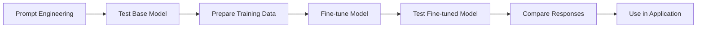
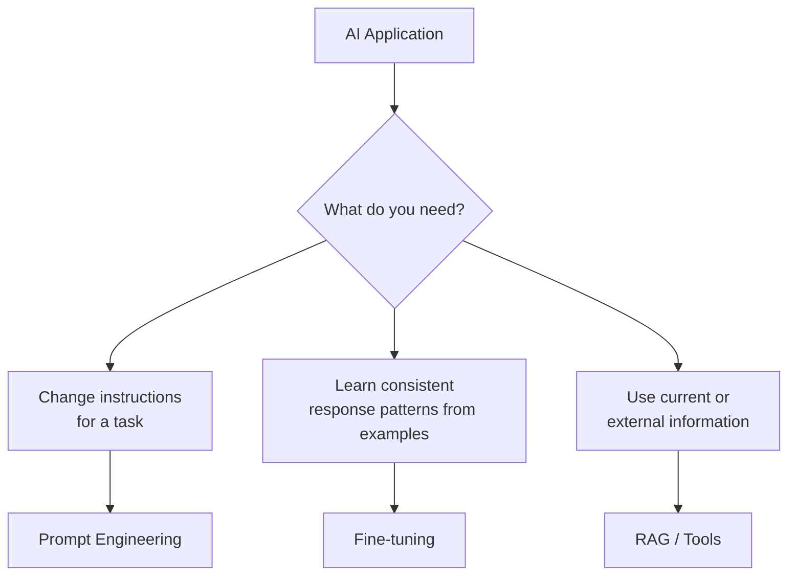

---
lab:
  title: Fine-tune a language model
  description: Learn how to use your own training data to fine-tune a model and customize its behavior.
  level: 300
  duration: 90
  islab: true
  status: 'released'
---

# Fine-tune a language model

**Prompt engineering** means giving a language model instructions for a specific task or conversation. For example, you can tell a model, *"Act as a credit analyst and explain your decision with the key factors."* The model follows those instructions for that interaction.

**Fine-tuning** is different. Instead of relying only on instructions, you provide the model with example inputs and the responses you expect. The model learns patterns from those examples and can produce more consistent responses for a specific use case.

### Real-world example

Imagine a bank wants an AI assistant to review business loan applications. You could provide examples showing how to assess:

* Company documents
* Compliance requirements
* Financial ratios
* Credit history
* Industry risk

For example, if a company's financial information is incomplete, the training examples can show the assistant that it should **identify the missing information instead of making assumptions**.

In this exercise, you will build a **credit risk management assistant** and explore how fine-tuning can influence its response patterns.

## What you will do

1. **Test the prepared `gpt-5.4-mini` model** in the playground and observe how different instructions affect its responses.
2. **Create a supervised fine-tuning job** using `gpt-4.1` and the provided training data. This step is optional if you want to save time.
3. **Review the training data** used for fine-tuning.
4. **Test the prepared fine-tuned model** and compare its responses with the base model.

The goal is to understand how example-based training can make model behavior more consistent for a specific use case.

This exercise takes approximately **90 minutes**. The fine-tuning job itself may take approximately **60–90 minutes** depending on available cloud capacity.

> **Note:** Some Microsoft Foundry features may be in preview or under active development. You may see warnings or minor differences in the portal interface.

## Prerequisites

Before you start, ensure that you have:

* An active [Azure subscription](https://azure.microsoft.com/free/)
* A web browser
* A Microsoft Foundry project prepared by your trainer or lab environment
* The **gpt-5.4-mini** model available for the initial playground test
* The **gpt-4.1** model available for supervised fine-tuning
* Permission to create fine-tuning jobs and upload datasets

> The project and required models are already prepared for this exercise. Do not create a new project or add another base model.

# Verify the existing project

Microsoft Foundry projects organize the models, resources, data, and other assets used to build an AI solution.

1. Open the [Microsoft Foundry portal](https://ai.azure.com) and sign in with your Azure credentials if you haven't already. Close any tips or quick-start panes that appear.

2. On the home page, ensure that you are in the **hakunamatata** project.

3. Open the model playground and confirm that the prepared **gpt-5.4-mini** model is available.

   > **Tip:** If you cannot find the project or **gpt-5.4-mini**, check with your trainer before continuing.

# Download the training data

1. Open the [training dataset](https://github.com/Kiran-255666/AgenticAIEngineer/blob/main/labfiles/Day03/lab04-fine-tuning/credit_risk_management.jsonl) in a browser.

2. Download the file and save it locally as `credit_risk_management.jsonl`.

   > **Important:** Your browser may save the file with a `.txt` extension. If it does, rename the file so that the filename ends with `.jsonl`.

# Start a fine-tuning job (Optional)

> **Tip:** The fine-tuning job can take approximately **60–90 minutes** to complete, depending on available cloud capacity. If you want to save time, you can **skip this section** and continue directly to **Test gpt-5.4-mini in the playground**. A prepared fine-tuned model is already available in the project, so you can use it later when you reach the **Test the fine-tuned model** section.

If you want to experience the complete fine-tuning workflow, continue with the steps below.

1. In the Foundry portal, select **Fine-tune** in the left navigation.

   

2. Select **Start fine-tuning**.

3. In **Basic details**, configure the job as follows:

   * **Customization method**: Supervised
   * **Model**: gpt-4.1
   * **Training type**: Data Zone

   

4. Select **Next**.

5. In **Datasets**, under **Training data source**, select **Upload or drag and drop**. Upload `credit_risk_management.jsonl`.

6. Confirm that the upload finishes and that the Dataset preview displays the file content and JSONL rows.

7. Leave **Validation data source (optional)** empty.

   

8. Select **Next** to open **Optional settings**.

9. Configure or confirm these settings:

   * **Display name**: Keep the generated name, or enter `ft-credit`
   * **Seed**: Keep the default value, **Random**
   * **Automatically deploy model after job completion**: Turn this **on**
   * **Deployment type**: **Developer**
   * **Hyperparameter tuning**: Keep **Default** selected for batch size, number of epochs, and learning-rate multiplier

   

10. Select **Submit** to start the fine-tuning job.

> **Note:** Fine-tuning and deployment can take approximately **60–90 minutes**. You do not need to wait for the job to finish before continuing with the playground testing.

# Test gpt-5.4-mini in the playground

> **Tip:** Keep a copy of the **prompts and model responses in Notepad** as you work through the steps. You will use them later to compare the base model with the fine-tuned model.

While the fine-tuning job is running, or if you skipped the optional fine-tuning section, test the prepared **gpt-5.4-mini** model in the playground. This will help you see how different instructions affect the model's responses.

1. Open the model playground for **gpt-5.4-mini**.

2. In the chat pane, enter:

```text
What can you do?
```

Review the response. It may be general because no task-specific instructions have been provided.

3. In the **Instructions** field, enter:

```text
You are an AI assistant that helps assess the creditworthiness of business clients.
```

4. Ask the same question again:

```text
What can you do?
```

Compare this response with the previous one. The model may now focus more on business credit assessment, but the behavior is still relatively general.

5. Replace the instructions with the following more detailed credit risk prompt:

```text
You are an AI credit risk management assistant that helps assess the creditworthiness of business clients. Your objective is to evaluate company documents, compliance status, financial ratios, external credit information, and industry risk using the provided credit risk assessment rules.

Do not invent missing financial or compliance information.

Clearly identify missing documents or data and explain how they affect the assessment.
```

6. Test the model using the following questions. For each response, record the **answer, tone, and writing style in Notepad**. You will use these responses later when testing the fine-tuned model.

### Question 1

```text
What documents are required to start a credit risk assessment?
```

### Question 2

```text
The client uploaded only the GST Certificate. Can we pass the document verification step?
```

### Question 3

```text
A company has a Current Ratio of 1.56, Debt-to-Equity of 1.86, and Net Profit Margin of 5.56%. How many points does it receive for these three financial metrics?
```

### Question 4

```text
How does industry risk affect the credit score?
```

### Question 5

```text
What happens if a sanctions or compliance match is confirmed?
```

7. Keep the responses in Notepad. You will compare these **gpt-5.4-mini base-model responses** with the responses from the **fine-tuned model** later in the lab.

# Review the training data

The training file contains examples of the response patterns and behavior that you want the fine-tuned model to learn.

1. Open the downloaded `credit_risk_management.jsonl` file in a text editor.

2. Review the JSONL entries. The first entry should look similar to the following example, formatted for readability:

```json
{"messages": [
  {
    "role": "system",
    "content": "You are an AI credit risk management assistant that helps assess the creditworthiness of business clients. Your objective is to evaluate company documents, compliance status, financial ratios, external credit information, and industry risk using the provided credit risk assessment rules. Do not invent missing financial or compliance information. Clearly identify missing documents or data and explain how they affect the assessment."
  },
  {
    "role": "user",
    "content": "What documents are required to start a credit risk assessment?"
  },
  {
    "role": "assistant",
    "content": "The assessment requires both the Company Registration Certificate and GST Certificate. The company name must match exactly across the client information and both certificates. The assessment should also verify the company's legal status, sanctions or adverse compliance records, financial statements for the last two financial years, and the latest external credit score or rating."
  }
]}
```

Each entry contains system instructions, a credit-risk-related user question, and an example assistant response. These examples provide the model with patterns for how to respond to credit risk questions, including terminology, structure, and the application of the assessment rules.

> **Note:** Fine-tuning is primarily used to influence response patterns and behavior. It should not be treated as a replacement for a knowledge base or retrieval system when an application needs frequently changing or authoritative information.

# Test the fine-tuned model

If you completed the optional fine-tuning job, you can use the model produced by that job after it has finished.

If you skipped the fine-tuning job, use the **prepared fine-tuned model** that is already available in the project.

1. In the left navigation, select **Models**.

2. Find and open the prepared fine-tuned model:

   **`-1-mini-2025-04-14-ft-e964800ce9314ff48f02e707134951d8-ft-credit`**

3. Open the fine-tuned model in the **model playground**.

4. In the **Instructions** field, enter the **same credit risk management prompt** used when testing the base model:

```text
You are an AI credit risk management assistant that helps assess the creditworthiness of business clients. Your objective is to evaluate company documents, compliance status, financial ratios, external credit information, and industry risk using the provided credit risk assessment rules.

Do not invent missing financial or compliance information.

Clearly identify missing documents or data and explain how they affect the assessment.
```

5. Ask the **same five questions** that you tested with the base **gpt-5.4-mini** model.

### Question 1

```text
What documents are required to start a credit risk assessment?
```

### Question 2

```text
The client uploaded only the GST Certificate. Can we pass the document verification step?
```

### Question 3

```text
A company has a Current Ratio of 1.56, Debt-to-Equity of 1.86, and Net Profit Margin of 5.56%. How many points does it receive for these three financial metrics?
```

### Question 4

```text
How does industry risk affect the credit score?
```

### Question 5

```text
What happens if a sanctions or compliance match is confirmed?
```

6. Compare the fine-tuned model responses with the **base-model responses saved in Notepad**.

Look for differences in:

* **Response consistency**
* **Tone and writing style**
* **Adherence to the credit risk instructions**
* **Use of the defined credit risk assessment rules**
* **Handling of missing information**
* **Accuracy and completeness of the responses**

> **Tip:** Use the responses you saved in Notepad as a direct reference when comparing the two models. This makes it easier to identify changes in response behavior after fine-tuning.

# Conclusion

In this lab, you learned how **fine-tuning** can be used to make a language model more consistent for a specific use case.

You first tested **gpt-5.4-mini** in the playground and used different instructions to see how they affected the model's responses. You then reviewed a **credit risk management dataset** in JSONL format and, if you chose to complete the optional step, used it to create a supervised fine-tuning job for **gpt-4.1**. Finally, you tested the prepared fine-tuned model using the same credit risk questions and compared its responses with the **gpt-5.4-mini** responses saved in Notepad.

The overall workflow can be summarized as follows:



The main takeaway is that **prompt engineering** and **fine-tuning** solve different problems:



Fine-tuning can be useful when you want a model to learn **task-specific response patterns, terminology, formats, or behaviors** from examples.

In real-world applications, fine-tuning can be used for use cases such as **customer support, document processing, classification, coding assistants, and internal business workflows**. The appropriate approach depends on the application's requirements, including the type of data, how often the information changes, expected performance, cost, and operational complexity.

Depending on the problem, you can use **prompt engineering, RAG, tools, fine-tuning, or a combination of these approaches**.

* **Prompt engineering** → Provides instructions for how the model should respond.
* **Fine-tuning** → Teaches the model response patterns using examples.
* **RAG** → Provides access to relevant external or frequently changing information.
* **Tools** → Allows the model to interact with external systems or perform actions.

> **Key takeaway:** Fine-tuning is not simply a way to give a model more information. It is primarily a way to shape how the model responds based on examples. For current or frequently changing information, approaches such as **RAG or tools** may be more appropriate.

By completing this lab, you have explored the complete workflow of preparing training examples, optionally starting a fine-tuning job, testing a base model, reviewing training data, testing a fine-tuned model, and comparing the resulting responses.