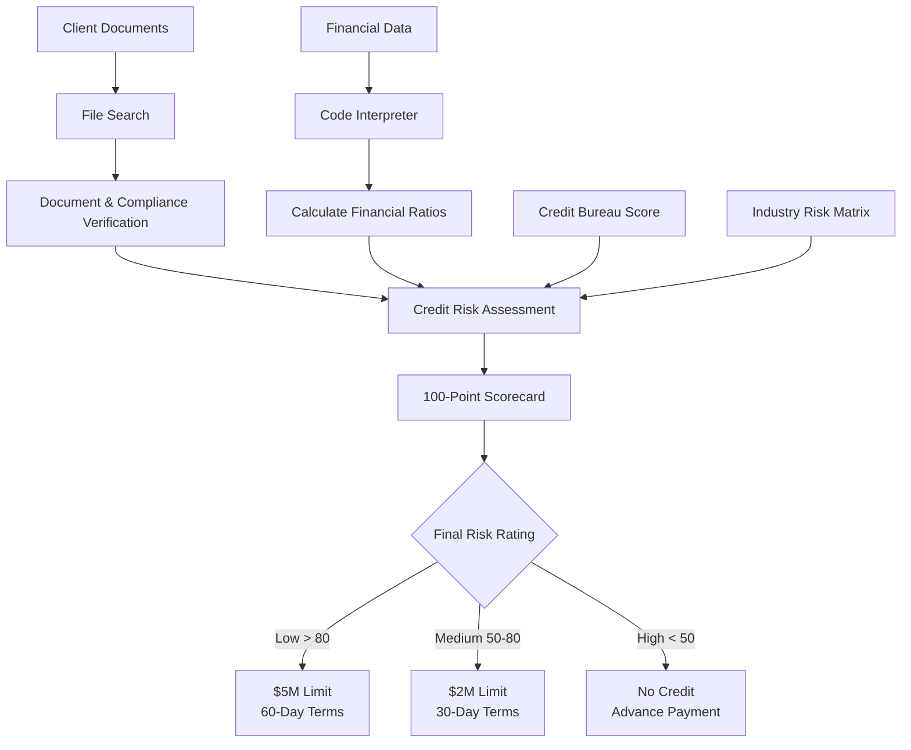

---
lab:
    title: 'Build AI agents with portal and VS Code'
    description: 'Create an AI agent using both Microsoft Foundry portal and the Foundry Toolkit VS Code extension with built-in tools like file search and code interpreter.'
    level: 300
    duration: 45
    islab: true
    status: 'released'
---

# Build AI agents with portal

In this exercise, you'll build an AI agent solution using a Microsoft Foundry project that has already been deployed and prepared for the lab. You'll create and configure an agent in the Foundry portal, then interact with it from Visual Studio Code by using the Foundry Toolkit extension and a Python client application.

This exercise takes approximately **45** minutes.

## Prerequisites

Before starting this exercise, ensure you have:

- Access to the Microsoft Foundry project prepared by your trainer or lab environment
- Permission to create and configure agents in that project
- [Visual Studio Code](https://code.visualstudio.com/) installed on your local machine
- [Python 3.12 or above](https://www.python.org/downloads/) or later installed
- [Git](https://git-scm.com/downloads) installed on your local machine
- Basic familiarity with Azure AI services and Python programming
- Install Azure CLI using the link- https://aka.ms/installazurecliwindows

> **Important:** The Microsoft Foundry project, resource, region, subscription, and deployed model are already provided. **Do not** create a new project or resource, deploy another model, or change the existing project settings. Use the provided project and continue by configuring the agent.

## Open the existing Microsoft Foundry project

Microsoft Foundry projects organize models, resources, data, and other assets used to develop an AI solution. For this lab, use the existing project prepared by your trainer or lab environment. Do **not** create a new project, Foundry resource, or model deployment.

1. Open the **Microsoft Foundry portal** at `https://ai.azure.com`. If you are not already signed in, select **Sign in** and sign in using your Azure credentials. Close any tips or quick-start panes that appear.

   > **Note:** If Foundry displays the **All resources** page, select the existing project provided for this lab. In this example, the project is named `hakunamatata1`.

   

2. On the project home page, make sure you are in the **`hakunamatata1`** project. In the **Build an agent** card, select **Start building**.

   

3. In the **Create an agent** dialog, enter `credit-risk-agent` as the **Agent name**.

4. Select **Create**.

   

The agent playground opens. An available deployed model should already be selected for you.


## Configure your agent with instructions and grounding data

The agent will act as a **Credit Risk Assessment Agent**. It will use uploaded company documents as grounding data and use **Code interpreter** to analyze financial information and calculate the required credit-risk metrics.

### 1. Configure the agent instructions

In the agent playground, set **Instructions** to:

```prompt
You are a Credit Risk Assessment Agent.

You assess the credit risk of client companies using the documents and financial information provided to you.

Follow these guidelines:

- Verify that both the Company Registration Certificate and GST Certificate are available.
- Compare the client company name with the name shown on both certificates. The names must match exactly.
- Check the company's legal status and identify whether it is Active or Inactive.
- Review sanctions, watchlists, and adverse compliance information when such data is provided.
- Confirm that audited or summarized financial statements are available for the last two financial years.
- Use the latest financial year to calculate Current Ratio, Debt-to-Equity, and Net Profit Margin.
- Use the provided external credit bureau score when available.
- Assign the Industry Risk Rating using the provided Industry Risk Matrix.
- Apply the provided credit-risk scorecard consistently.
- Clearly show the evidence used for each assessment.
- Do not invent missing information. If required information is unavailable, clearly state that it could not be verified.
- Provide the final risk rating, recommended credit limit, and payment terms only when the required information is available.
- Keep the assessment professional, concise, and easy for a credit analyst to review.
```


### 2. Add the credit-risk grounding document

Download the credit-risk assessment rules and supporting documentation provided with the lab.

The grounding material should contain the assessment process, including:

* Required company documents
* Company-name verification rules
* Legal-status checks
* Sanctions and adverse compliance checks
* Financial-statement requirements
* Current Ratio calculation
* Debt-to-Equity calculation
* Net Profit Margin calculation
* External credit bureau scoring
* Industry Risk Matrix
* Final 100-point scorecard
* Credit-limit and payment-term recommendations

Save the document locally using a suitable name such as:

```text
Credit_Risk_Assessment_Rules.txt
```

> **Note:** This document provides the rules the agent should follow when performing a credit-risk assessment. The agent should use the document as grounding data rather than relying only on its general knowledge.

### 3. Enable File search

Return to the agent playground.

In the **Tools** section, select **Add**. Under **Most Popular**, select **File search**.

If File search is not displayed, select **Add** again, choose **Add tools**, select **File search**, and then select **Add tool**.


After adding File search, you will be redirected to a page where you can see **Drag and drop files here or browse for files**.

Upload:

```text
Credit_Risk_Assessment_Rules.txt
```

After attaching the file, verify that its status shows **Success**, and then select **Attach**.

Wait for the file to be indexed before continuing.

### 4. Add the company documents

Upload the company documents required for the assessment, such as:

```text
Company_Registration_Certificate
GST_Certificate
```

You can either drag and drop the files or browse your local files.

After attaching the documents, verify that the upload status shows **Success**.

These documents will allow the agent to verify whether the required company documentation is present and whether the company name matches across the submitted certificates.

### 5. Enable Code interpreter

In the **Tools** section, select **Add**.

Under **Most Popular**, select **Code interpreter** and toggle it on.

If it is not displayed, select **Add** again, choose **Add tools**, select **Code interpreter**, and then select **Add tool**.


Code interpreter will be used to process financial data and perform calculations such as:

```text
Current Ratio = Current Assets / Current Liabilities

Debt-to-Equity = Total Debt / Shareholders' Equity

Net Profit Margin = Net Profit / Revenue × 100
```

### 6. Upload the financial data

Download the financial data file provided with the lab and save it locally.

For example:

```text
financial_data.csv
```

The file should contain the financial information required to calculate the credit-risk metrics for the latest financial year, such as:

* Current Assets
* Current Liabilities
* Total Debt
* Shareholders' Equity
* Revenue
* Net Profit
* External Credit Bureau Score
* Industry

To the right of **Code interpreter**, select **+ Files**.

Upload `financial_data.csv` by dragging and dropping it or browsing to the file.

After attaching the file, verify that the status shows **Success**, then select **Attach**.

> **Note:** The financial data is used by Code interpreter for calculations and analysis. The agent should use the latest available financial year when calculating the required ratios.

### 7. Save the agent

Select **Save** to save the configured credit-risk agent.

---

## Test your credit-risk agent

Test the agent to confirm that it can retrieve information from the grounding documents and use Code interpreter for financial analysis.

### 1. Verify the required documents

In the playground chat pane, enter:

```text
Verify whether the Company Registration Certificate and GST Certificate are available for the client. Also compare the company name shown on both documents.
```

Review the response.

The agent should identify the available documents and compare the company name across them.


### 2. Test the credit-risk assessment rules

Enter:

```text
What checks must be completed before assigning a credit risk rating?
```

Review the response.

The agent should retrieve the assessment process from the uploaded credit-risk grounding document.

It should identify requirements such as:

* Document verification
* Company-name matching
* Legal status
* Compliance checks
* Financial statements
* Financial ratios
* Credit bureau score
* Industry risk
* Final scorecard


### 3. Test financial calculations with Code interpreter

Enter:

```text
Analyze the financial data and calculate the Current Ratio, Debt-to-Equity, and Net Profit Margin for the latest financial year.
```

The agent should use **Code interpreter** to process the financial data and calculate the three required metrics.

Review the calculations and verify that the values are based on the uploaded data.


### 4. Test the Industry Risk Matrix

Enter:

```text
Using the Industry Risk Matrix, determine the industry risk rating for the client and explain the score assigned.
```

The agent should use the provided Industry Risk Matrix:

| Industry Risk | Industries                                                                                  | Score |
| ------------- | ------------------------------------------------------------------------------------------- | ----: |
| Low           | Utilities, Government, Healthcare                                                           |    15 |
| Medium        | Manufacturing, FMCG distribution, IT services                                               |     8 |
| High          | Construction, Real estate developers, Airlines, Commodity trading, Startups, Mining & Metal |     3 |

The response should clearly identify the industry category and corresponding score.

### 5. Generate the final credit-risk assessment

Enter:

```text
Using all available documents and financial data, complete the credit-risk assessment. Calculate the required financial ratios, apply the scorecard, determine the final risk rating, and provide the recommended credit limit and payment terms. Clearly show how the final score was calculated.
```

The agent should combine the information retrieved through **File search** with the calculations performed using **Code interpreter**.

The scorecard is:

| Category                   | Maximum Score |
| -------------------------- | ------------: |
| Compliance                 |            20 |
| Liquidity (Current Ratio)  |            20 |
| Leverage (Debt-to-Equity)  |            15 |
| Profitability (Net Margin) |            15 |
| External Credit Bureau     |            15 |
| Industry Risk              |            15 |
| **Total**                  |       **100** |

The agent should apply the provided scoring rules consistently and explain the resulting assessment.

### 6. Request a visualization

Enter:

```text
Create a chart showing the company's Current Ratio, Debt-to-Equity, and Net Profit Margin.
```

The agent should use **Code interpreter** to process the financial values and generate a suitable visualization.


The visualization may be generated successfully, but in some cases you may not be able to download the generated file directly from the agent playground. If this happens, you can copy the code generated by the agent and run it in **VS Code**, **Jupyter Notebook**, or **Google Colab** using the same financial data.


---

## Understand the complete credit-risk flow

The agent combines document grounding, financial analysis, and the credit-risk scorecard into a single assessment workflow.



> **Tip:** The exact decision should always be based on the supplied documents and data. If required information is missing or cannot be verified, the agent should clearly identify the missing information rather than inventing a result.

---

## Summary

You used an existing Microsoft Foundry project and its deployed model to create a **Credit Risk Assessment Agent**.

You:

* Configured the agent with credit-risk assessment instructions.
* Grounded the agent with company and credit-risk documentation using **File search**.
* Verified required company documents and company-name consistency.
* Used **Code interpreter** to calculate Current Ratio, Debt-to-Equity, and Net Profit Margin.
* Applied the Industry Risk Matrix and 100-point credit-risk scorecard.
* Combined compliance, financial, bureau, and industry information into a structured assessment.
* Tested the agent with document-verification, financial-analysis, scoring, and visualization prompts.
* Generated a visualization from the financial data using **Code interpreter**.

This demonstrates how a Microsoft Foundry agent can combine **grounded business documents + financial calculations + structured decision rules** to support a practical credit-risk assessment workflow.