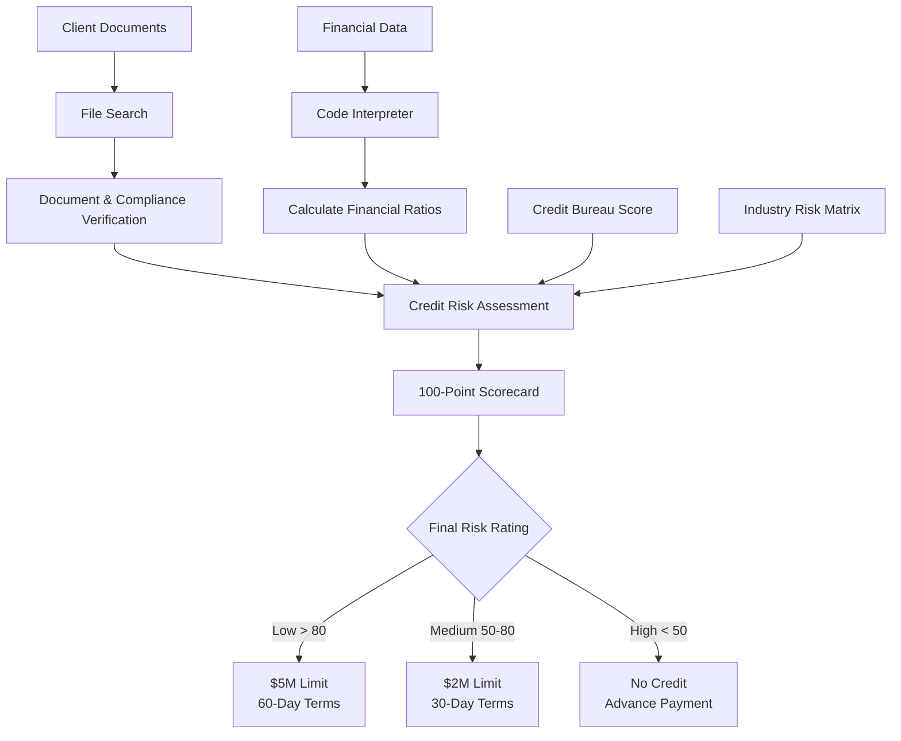

---
lab:
    title: 'Build AI agents with portal and VS Code'
    description: 'Create an AI agent using both Microsoft Foundry portal and the Foundry Toolkit VS Code extension with built-in tools like file search and code interpreter.'
    level: 300
    duration: 45
    islab: true
    status: 'released'
---

# Build AI agents with portal

In this exercise, you'll build an AI agent solution using a Microsoft Foundry project that has already been deployed and prepared for the lab. You'll create and configure an agent in the Foundry portal, then interact with it from Visual Studio Code by using the Foundry Toolkit extension and a Python client application.

This exercise takes approximately **45** minutes.

## Prerequisites

Before starting this exercise, ensure you have:

- Access to the Microsoft Foundry project prepared by your trainer or lab environment
- Permission to create and configure agents in that project
- [Visual Studio Code](https://code.visualstudio.com/) installed on your local machine
- [Python 3.12 or above](https://www.python.org/downloads/) or later installed
- [Git](https://git-scm.com/downloads) installed on your local machine
- Basic familiarity with Azure AI services and Python programming
- Install Azure CLI using the link- https://aka.ms/installazurecliwindows

> **Important:** The Microsoft Foundry project, resource, region, subscription, and deployed model are already provided. **Do not** create a new project or resource, deploy another model, or change the existing project settings. Use the provided project and continue by configuring the agent.

## Open the existing Microsoft Foundry project

Microsoft Foundry projects organize models, resources, data, and other assets used to develop an AI solution. For this lab, use the existing project prepared by your trainer or lab environment. Do **not** create a new project, Foundry resource, or model deployment.

1. Open the **Microsoft Foundry portal** at `https://ai.azure.com`. If you are not already signed in, select **Sign in** and sign in using your Azure credentials. Close any tips or quick-start panes that appear.

   > **Note:** If Foundry displays the **All resources** page, select the existing project provided for this lab. In this example, the project is named `hakunamatata1`.

   

2. On the project home page, make sure you are in the **`hakunamatata1`** project. In the **Build an agent** card, select **Start building**.

   

3. In the **Create an agent** dialog, enter `credit-risk-agent` as the **Agent name** and make sure **Interaction mode** is set to **Text**.

4. Select **Create**.

   

The agent playground opens. An available deployed model should already be selected for you.


## Configure your agent with instructions and grounding data

The agent will act as a **Credit Risk Assessment Agent**. It will use uploaded company documents as grounding data and use **Code interpreter** to analyze financial information and calculate the required credit-risk metrics.

### 1. Configure the agent instructions

In the agent playground, set **Instructions** to:

```prompt
You are a Credit Risk Assessment Agent.

You assess the credit risk of client companies using the documents and financial information provided to you.

Follow these guidelines:

- Verify that both the Company Registration Certificate and GST Certificate are available.
- Compare the client company name with the name shown on both certificates. The names must match exactly.
- Check the company's legal status and identify whether it is Active or Inactive.
- Review sanctions, watchlists, and adverse compliance information when such data is provided.
- Confirm that audited or summarized financial statements are available for the last two financial years.
- Use the latest financial year to calculate Current Ratio, Debt-to-Equity, and Net Profit Margin.
- Use the provided external credit bureau score when available.
- Assign the Industry Risk Rating using the provided Industry Risk Matrix.
- Apply the provided credit-risk scorecard consistently.
- Clearly show the evidence used for each assessment.
- Do not invent missing information. If required information is unavailable, clearly state that it could not be verified.
- Provide the final risk rating, recommended credit limit, and payment terms only when the required information is available.
- Keep the assessment professional, concise, and easy for a credit analyst to review.
```


### 2. Add the credit-risk grounding document

Download the **[textfiles.zip](https://download-directory.github.io/?url=https%3A%2F%2Fgithub.com%2FKiran-255666%2FAgenticAIEngineer%2Ftree%2Fmain%2Ftextfiles)** file and extract the ZIP file.

The grounding material (i.e., ****Credit_Risk_Assessment_Rules.txt***) contains the assessment process, including:

* Required company documents
* Company-name verification rules
* Legal-status checks
* Sanctions and adverse compliance checks
* Financial-statement requirements
* Current Ratio calculation
* Debt-to-Equity calculation
* Net Profit Margin calculation
* External credit bureau scoring
* Industry Risk Matrix
* Final 100-point scorecard
* Credit-limit and payment-term recommendations

> **Note:** This document provides the rules the agent should follow when performing a credit-risk assessment. The agent should use the document as grounding data rather than relying only on its general knowledge.

### 3. Enable File search

Return to the agent playground.

1. In the **Tools** section, select **Add**. Under **Most Popular**, select **File search**.

   **Tip:** If **File search** is not displayed under **Most Popular**, select **Add** again, choose **Add tools**, select **File search** under **Configured**, and then select **Add tool**.

   

2. After adding **File search**, you will be redirected to a page where you can create or select a vector index.

3. Under **Vector index name**, enter:

   ```text
   credit-risk-assessment-index
   ```

4. Under ****Drag and drop files here or browse for files****, upload ****Credit_Risk_Assessment_Rules.txt****, which you downloaded earlier.

5. After attaching the file, verify that its status shows **Success**, and then select **Attach**.

6. Wait for the file to be indexed before continuing.

### 4. Enable Code interpreter

1. In the **Tools** section, select **Add**. Under **Most Popular**, select **Code interpreter** and toggle it on.

   **Tip:** If it is not displayed, select **Add** again, choose **Add tools**, select **Code interpreter**, and then select **Add tool**.

   

2. The `textfiles` folder, which you downloaded earlier as part of the lab, already contains the following file:

   ```text
   Forumlas.txt
   ```

   This file contains the calculation rules for:

   ```text
   Current Ratio = Current Assets / Current Liabilities

   Debt-to-Equity = Total Debt / Shareholders' Equity

   Net Profit Margin = (Net Profit / Revenue) × 100
   ```

   It also specifies that the **latest available financial year** should be used for these calculations.

3. In the **Code interpreter** section, select **+ Files** and upload `Forumlas.txt` from the `textfiles` folder using **Drag and drop files here** or **browse for files**.

4. Verify that the file status shows **Success**, then select **Attach**.

The Code interpreter can now use these calculation rules when analyzing the financial data.

### 5. Upload the financial data

1. Use the `financial_data.csv` file that you downloaded earlier as part of the lab.

2. The file contains the financial information required to calculate the credit-risk metrics for the latest financial year, including:

   * Current Assets
   * Current Liabilities
   * Total Debt
   * Shareholders' Equity
   * Revenue
   * Net Profit
   * External Credit Bureau Score
   * Industry

3. To the right of **Code interpreter**, select **+ Files**.

4. Upload `financial_data.csv` using **Drag and drop files here** or **browse for files**.

5. After attaching the file, verify that the status shows **Success**, then select **Attach**.

   **Note:** The agent will use the uploaded financial data together with the calculation rules to calculate and analyze the required credit-risk metrics.

### 6. Save the agent

1. Select **Save** to save the configured credit-risk agent.

---

Yeah man. Since you’re **not using PNG screenshots anymore**, the testing section should focus on **what the user should enter and what kind of result they should expect**, without forcing exact wording. Add a note that AI responses may differ but should contain the same key information.

Here’s the cleaned-up version:

## Test your credit-risk agent

Test the agent to confirm that it can retrieve information from the grounding documents and use Code interpreter for financial analysis.

> **Note:** The agent's response may not match the examples word-for-word. Responses can vary depending on the model and context. Verify that the response contains the expected information, calculations, and reasoning described in each test.

### 1. Verify the required documents

1. In the playground chat pane, enter:

```text
Verify whether the Company Registration Certificate and GST Certificate are available for the client. Also compare the company name shown on both documents.
```

2. Review the response.

The agent should identify whether the required documents are available and compare the company name across the certificates.

If a required document is missing, the agent should clearly state that it cannot complete the verification rather than assuming the document is available.

### 2. Test the credit-risk assessment rules

1. Enter:

```text
What checks must be completed before assigning a credit risk rating?
```

2. Review the response.

The agent should retrieve the assessment process from the uploaded credit-risk grounding document.

The response should cover the main checks, including:

* Document verification
* Company-name matching
* Legal status
* Compliance and sanctions checks
* Financial statements
* Financial ratios
* Credit bureau score
* Industry risk
* Final scorecard

The exact wording or order may differ, but the response should be consistent with the rules provided in `Credit_Risk_Assessment_Rules.txt`.

### 3. Test financial calculations with Code interpreter

1. Enter:

```text
Analyze the financial data and calculate the Current Ratio, Debt-to-Equity, and Net Profit Margin for the latest financial year.
```

2. The agent should use **Code interpreter** to process `financial_data.csv` and calculate the required metrics.

3. Review the calculations and verify that they are based on the uploaded financial data.

The response should provide:

* Current Ratio
* Debt-to-Equity
* Net Profit Margin
* The latest financial year used for the calculation

The numerical presentation may vary, but the calculated values should be consistent with the uploaded data and the rules in `Credit_Risk_Calculation_Rules.txt`.

### 4. Test the Industry Risk Matrix

1. Enter:

```text
Using the Industry Risk Matrix, determine the industry risk rating for the client and explain the score assigned.
```

2. Review the response.

The agent should use the Industry Risk Matrix from the credit-risk rules:

| Industry Risk | Industries                                                                                  | Score |
| ------------- | ------------------------------------------------------------------------------------------- | ----: |
| Low           | Utilities, Government, Healthcare                                                           |    15 |
| Medium        | Manufacturing, FMCG distribution, IT services                                               |     8 |
| High          | Construction, Real estate developers, Airlines, Commodity trading, Startups, Mining & Metal |     3 |

The response should identify the client's industry, corresponding risk category, and assigned score.

### 5. Generate the final credit-risk assessment

1. Enter:

```text
Using all available documents and financial data, complete the credit-risk assessment. Calculate the required financial ratios, apply the scorecard, determine the final risk rating, and provide the recommended credit limit and payment terms. Clearly show how the final score was calculated.
```

2. Review the response.

The agent should combine information retrieved through **File search** with calculations performed using **Code interpreter**.

The assessment should consider:

| Category                   | Maximum Score |
| -------------------------- | ------------: |
| Compliance                 |            20 |
| Liquidity (Current Ratio)  |            20 |
| Leverage (Debt-to-Equity)  |            15 |
| Profitability (Net Margin) |            15 |
| External Credit Bureau     |            15 |
| Industry Risk              |            15 |
| **Total**                  |       **100** |

3. Verify that the agent explains how the individual scores contribute to the final score and applies the rules from the uploaded credit-risk documentation.

> **Note:** The final response may be formatted differently or use different wording. The important point is that the agent uses the available evidence, applies the supplied scoring rules, and does not invent missing information.

### 6. Request a visualization

1. Enter:

```text
Create a chart showing the company's Current Ratio, Debt-to-Equity, and Net Profit Margin.
```

2. The agent should use **Code interpreter** to process the financial values and generate a suitable visualization.

3. Review the generated visualization and confirm that it represents the calculated financial metrics.

> **Note:** The chart style, layout, labels, and presentation may vary. The visualization should represent the Current Ratio, Debt-to-Equity, and Net Profit Margin calculated from the uploaded financial data.

---

## Understand the complete credit-risk flow

The agent combines document grounding, financial analysis, and the credit-risk scorecard into a single assessment workflow.



**Tip:** The exact decision should always be based on the supplied documents and data. If required information is missing or cannot be verified, the agent should clearly identify the missing information rather than inventing a result.

---

## Summary

You used an existing Microsoft Foundry project and its deployed model to create a **Credit Risk Assessment Agent**.

You:

* Configured the agent with credit-risk assessment instructions.
* Grounded the agent with credit-risk documentation using **File search**.
* Verified required company documents and company-name consistency.
* Used **Code interpreter** to calculate Current Ratio, Debt-to-Equity, and Net Profit Margin.
* Applied the Industry Risk Matrix and 100-point credit-risk scorecard.
* Combined compliance, financial, bureau, and industry information into a structured assessment.
* Tested the agent with document-verification, financial-analysis, scoring, and visualization prompts.
* Generated a visualization from the financial data using **Code interpreter**.

This demonstrates how a Microsoft Foundry agent can combine **grounded business documents, financial calculations, and structured decision rules** to support a practical credit-risk assessment workflow.
