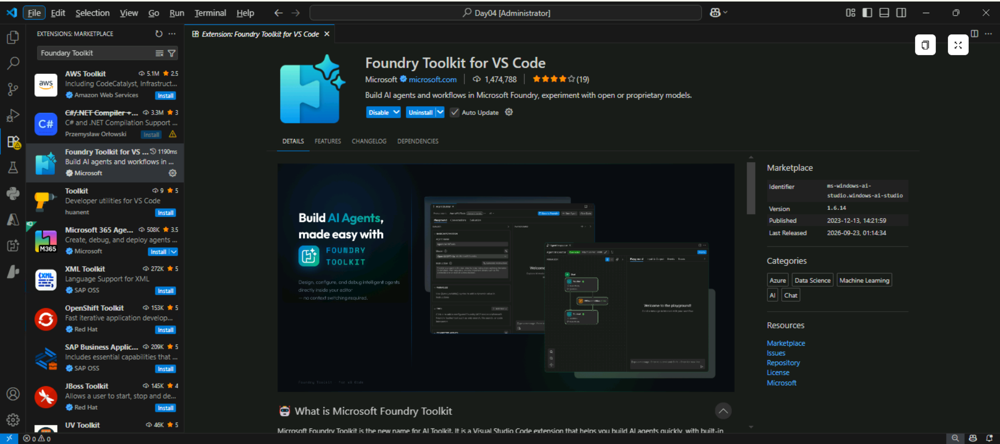
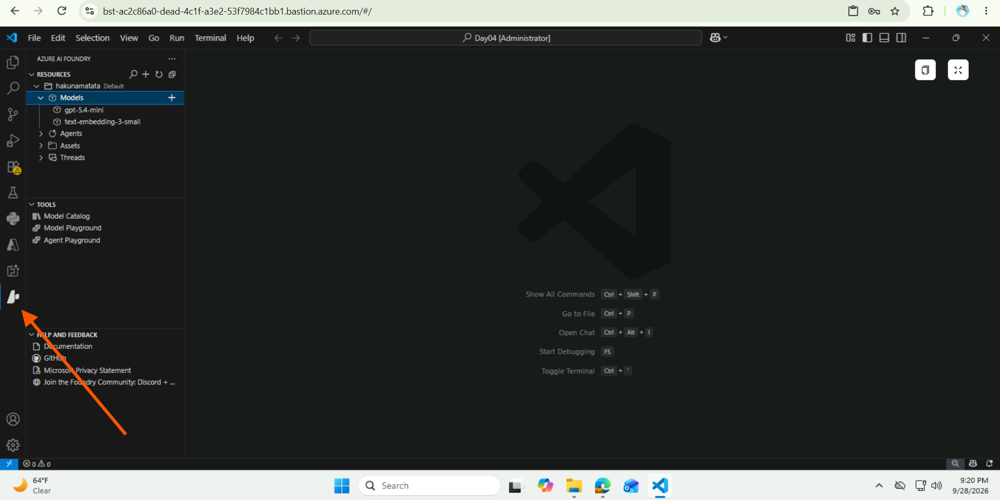
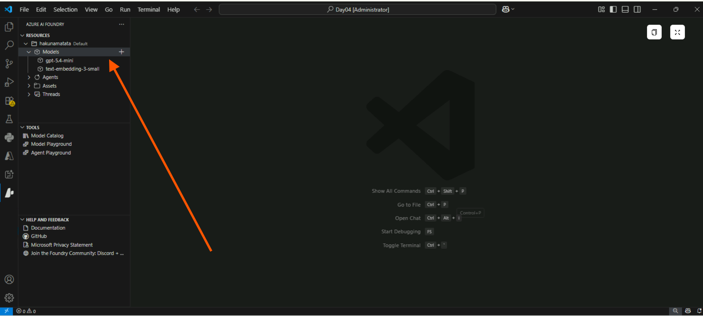
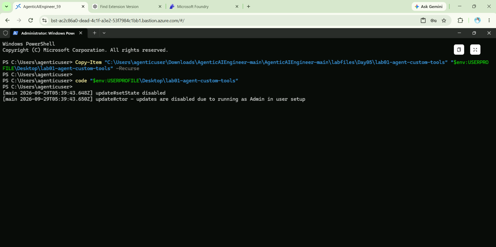
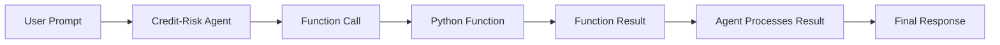

---
lab:
    title: 'Use a custom function in an AI agent'
    description: 'Learn how to use functions to add custom capabilities to your agents.'
    level: 300
    duration: 45
    islab: true
    status: 'released'
---

# Use a custom function in an AI agent

> **Note:** We have already updated the mentioned files with the code provided in the instructions. However, we highly recommend going through the code once before executing it.

In this exercise, you'll explore how an AI agent can use custom functions as tools to perform specific tasks. These functions support different steps in a credit-risk assessment workflow, such as verifying required documents, performing financial calculations, and generating risk summaries. You'll review the functions, connect them to the agent, and see how the agent processes function calls and uses their results.

This exercise should take approximately **45** minutes to complete.

## Prerequisites

Before starting this exercise, ensure you have:

- [Visual Studio Code](https://code.visualstudio.com/) installed on your local machine
- An active [Azure subscription](https://azure.microsoft.com/free/)
- [Python 3.12 or above](https://www.python.org/downloads/) is recommended
- [Git](https://git-scm.com/downloads) installed on your local machine

> Python 3.12 is the recommended version for this lab. Python 3.14 is available, but some dependencies are not yet compiled for that release.

## Set up Azure CLI and the Foundry Toolkit for VS Code

1. Before starting the lab, install ****Azure CLI**** using the following link: [https://aka.ms/installazurecliwindows]. Click the link to download the installer. The download will start automatically and the installer will be available in your ****Downloads**** folder.

> If the download does not start automatically, copy and paste the link into your browser.


2. After the download is complete, open the ****Downloads**** folder and double-click the downloaded installer. Follow the instructions shown by the installer to complete the installation.

   

3. Open **Visual Studio Code** by typing **Code** in the Windows search bar, then click **Code** to open it.

4. Open the integrated terminal using ****Ctrl+Shift+`**** and run the following command to sign in to Azure:

```powershell
az login
```

A browser window or pop-up will open asking you to sign in. If you do not see the sign-in window, minimize all open windows and tabs to check if it is open in the background. Sign in using the account provided by your trainer.

After a successful sign-in, you may see the following prompt in the terminal:

```text
Select a subscription and tenant (Type a number or Enter for no changes):
```

Type ****1**** and press ****Enter**** to select the subscription provided by your trainer.

To verify that you are successfully signed in, run:

```powershell
az account show
```

This command will display your current Azure account and subscription details.

> ****Tip:**** If you face an error during sign-in, run the following commands and try again:
>
> ```powershell
> az logout
> az login
> az account show
> ```
>
> Complete the sign-in again using the account provided by your trainer.

5. If the `az` command is not recognized, for example, `'az' is not recognized as a name of a cmdlet, function, script file, or executable program`, Azure CLI may not have been installed correctly, or the terminal may have been opened before the installation updated the system PATH.

> ****Troubleshooting:**** Try the following steps:
>
> 1. Close and reopen the integrated terminal, then run `az login` again. If the issue persists, restart **Visual Studio Code** and try again.
>
> 2. If the error still persists, uninstall and reinstall Azure CLI using the following commands:
>
> ```powershell
> winget uninstall Microsoft.AzureCLI
> winget install Microsoft.AzureCLI
> ```
>
> 3. After the installation is complete, restart the integrated terminal and run `az login` again.


As a developer, you may spend time working in the **Microsoft Foundry portal**, but most development tasks are typically performed in **Visual Studio Code**. The **Foundry Toolkit** extension allows you to work with Foundry project resources directly within **Visual Studio Code**, so you can manage and develop your Foundry projects without leaving your development environment.

6. Select **Extensions** from the left pane (or press **Ctrl+Shift+X**).

7. Search the Extensions Marketplace for the **Foundry Toolkit for VS Code** extension from Microsoft and select **Install**.

   

8. After installing the extension, you will see two new icons in the sidebar: ****AI Toolkit**** and ****Azure AI Foundry****. Select the ****Azure AI Foundry**** icon to view your Foundry resources directly in Visual Studio Code without opening **ai.azure.com**.

   

9. You can now use the **Azure AI Foundry** extension to view and manage your Foundry project resources directly from Visual Studio Code.

## Use the deployed model

Use the deployed model already available in your Foundry project. Under **Models**, find your deployed model, right-click it, and select the endpoint option based on your use case:

* **Azure AI Model inference endpoint** for Azure AI model inference client libraries.
* **Azure OpenAI in Foundry Models endpoint** for Azure OpenAI in Foundry Models client libraries.

For this lab, you need the **Project endpoint**, which is already prefilled in the `.env` file.

> **Note:** You can get the Project endpoint from the Azure AI Foundry portal. If you prefer not to use the portal, copy any available endpoint, remove everything after `.com/`, and append `api/projects/<your-project-name>`.
>
> Example:
> `https://hakunamatata11.services.ai.azure.com/models`
> → `https://hakunamatata11.services.ai.azure.com/api/projects/hakunamatata`




# Get the application files from GitHub

1. If you have already downloaded and extracted the repository in a previous lab, delete the existing ZIP file and the extracted folder. This will allow us to use the PowerShell commands in the following steps and help avoid long path issues.

2. Open a web browser and go to the [lab files on GitHub](https://github.com/Kiran-255666/AgenticAIEngineer).

3. On the repository page, select the green **`<> Code`** button, and then select **Download ZIP**.

4. Once the download finishes, extract the ZIP file.

5. Open ****PowerShell**** and run the following two commands to avoid long path issues:

   

```powershell
Copy-Item "C:\Users\agenticuser\Downloads\AgenticAIEngineer-main\AgenticAIEngineer-main\labfiles\Day05\lab01-agent-custom-tools" "$env:USERPROFILE\Desktop\lab01-agent-custom-tools" -Recurse

code "$env:USERPROFILE\Desktop\lab01-agent-custom-tools"
```

The first command copies the lab folder to your ****Desktop****, and the second command opens the copied folder directly in ****Visual Studio Code****.

This folder already contains the application files and the required code for this exercise.

> ****Note:**** The `agent.py` and `functions.py` files have already been updated with the implementation required for this exercise. You do not need to enter the code manually again. However, we recommend reviewing the code to understand each section before running the application.

6. You are now working from the ****Desktop**** folder, so there is no need to worry about the long path issue. Press ****Ctrl+Shift+`**** to open the integrated terminal.

7. In the terminal, enter the following commands to create and activate a virtual environment and install the required Python packages:

   ```
   python -m venv labenv
   .\labenv\Scripts\Activate.ps1
   pip install -r requirements.txt
   ```

8. The ****.env**** file is already configured for you. You do not need to change any of the existing values.

> ****Tip:**** In general, if the ****.env**** file is not configured, you can use the previously installed ****Azure AI Foundry**** extension to get the required values. The **project endpoint** can be copied from the project deployment resource in the ****Foundry Toolkit**** extension in Visual Studio Code. You may need to do this in upcoming labs or when setting up your own projects in the future.

You are now ready to review and run an AI agent that uses custom function tools.

## Review the functions used by the agent

The required functions have already been added to **`functions.py`**. Review the file before running the application.

The file contains three functions:

* `verify_documents()` — checks whether the required company registration and GST documents are available.
* `calculate_financial_ratios()` — calculates basic financial ratios used in credit-risk assessment.
* `generate_risk_summary()` — generates a credit-risk summary using the calculated financial indicators and configured thresholds.

The file also loads the document requirements and risk thresholds from the `data` folder:

```python
DOCUMENT_REQUIREMENTS = _load_requirements()
RISK_THRESHOLDS = _load_thresholds()
```

The document requirements are loaded from:

```text
data/document_requirements.txt
```

The risk thresholds are loaded from:

```text
data/risk_thresholds.txt
```

### `verify_documents`

The implementation is:

```python
def verify_documents(
    company_registration: bool,
    gst_certificate: bool
) -> str:
    """Check whether the required company documents are available."""

    documents_complete = (
        company_registration and gst_certificate
    )

    return json.dumps({
        "required_documents": list(
            DOCUMENT_REQUIREMENTS.values()
        ),
        "company_registration": company_registration,
        "gst_certificate": gst_certificate,
        "documents_complete": documents_complete,
        "status": (
            "Documents verified"
            if documents_complete
            else "Required documents are missing"
        )
    })
```

This function checks whether the **Company Registration Certificate** and **GST Certificate** are marked as available.

If both documents are available, `documents_complete` is set to `True` and the function returns a successful verification status. Otherwise, it reports that required documents are missing.

### `calculate_financial_ratios`

The implementation is:

```python
def calculate_financial_ratios(
    current_assets: float,
    current_liabilities: float,
    total_debt: float,
    equity: float,
    net_profit: float,
    revenue: float
) -> str:
    """Calculate basic financial ratios for credit-risk assessment."""

    if current_liabilities <= 0:
        return json.dumps({
            "error": "Current liabilities must be greater than zero."
        })

    if equity <= 0:
        return json.dumps({
            "error": "Equity must be greater than zero."
        })

    if revenue <= 0:
        return json.dumps({
            "error": "Revenue must be greater than zero."
        })

    current_ratio = current_assets / current_liabilities
    debt_to_equity = total_debt / equity
    net_profit_margin = (net_profit / revenue) * 100

    return json.dumps({
        "current_ratio": round(current_ratio, 2),
        "debt_to_equity": round(debt_to_equity, 2),
        "net_profit_margin": round(net_profit_margin, 2),
        "thresholds": {
            "current_ratio_good": RISK_THRESHOLDS[
                "current_ratio_good"
            ],
            "current_ratio_medium": RISK_THRESHOLDS[
                "current_ratio_medium"
            ],
            "debt_to_equity_good": RISK_THRESHOLDS[
                "debt_to_equity_good"
            ],
            "debt_to_equity_medium": RISK_THRESHOLDS[
                "debt_to_equity_medium"
            ],
            "net_profit_margin_good": RISK_THRESHOLDS[
                "net_profit_margin_good"
            ],
            "net_profit_margin_medium": RISK_THRESHOLDS[
                "net_profit_margin_medium"
            ]
        }
    })
```

This function calculates three financial indicators:

* **Current Ratio** = Current Assets ÷ Current Liabilities
* **Debt-to-Equity Ratio** = Total Debt ÷ Equity
* **Net Profit Margin** = (Net Profit ÷ Revenue) × 100

It also returns the configured thresholds used for evaluating these indicators.

The function checks that current liabilities, equity, and revenue are greater than zero before performing the calculations.

### `generate_risk_summary`

The implementation is:

```python
def generate_risk_summary(
    company_name: str,
    current_ratio: float,
    debt_to_equity: float,
    net_profit_margin: float
) -> str:
    """Generate a summary of the calculated credit-risk indicators."""

    if (
        current_ratio >= RISK_THRESHOLDS["current_ratio_good"]
        and debt_to_equity <= RISK_THRESHOLDS["debt_to_equity_good"]
        and net_profit_margin >= RISK_THRESHOLDS["net_profit_margin_good"]
    ):
        risk_level = "Low"

    elif (
        current_ratio >= RISK_THRESHOLDS["current_ratio_medium"]
        and debt_to_equity <= RISK_THRESHOLDS["debt_to_equity_medium"]
        and net_profit_margin >= RISK_THRESHOLDS["net_profit_margin_medium"]
    ):
        risk_level = "Medium"

    else:
        risk_level = "High"

    return json.dumps({
        "company_name": company_name,
        "current_ratio": current_ratio,
        "debt_to_equity": debt_to_equity,
        "net_profit_margin": net_profit_margin,
        "risk_level": risk_level,
        "status": "Risk summary generated successfully"
    })
```

This function uses the calculated financial indicators and the thresholds loaded from `risk_thresholds.txt` to determine a **Low**, **Medium**, or **High** risk level.

> **Important:** The functions have already been added to `functions.py`. Review the implementation rather than adding the functions manually.

## Review the Foundry project connection

Open **`agent.py`** and review the imports and project connection.

The required imports have already been added:

```python
import os
import json
from dotenv import load_dotenv

from azure.ai.projects import AIProjectClient
from azure.ai.projects.models import PromptAgentDefinition, FunctionTool
from azure.identity import AzureCliCredential
from openai.types.responses.response_input_param import (
    FunctionCallOutput,
    ResponseInputParam,
)

from functions import (
    verify_documents,
    calculate_financial_ratios,
    generate_risk_summary,
)
```

Notice that the three functions from `functions.py` are imported so they can be executed when the agent requests the corresponding function tools.

The application loads the project configuration from `.env`:

```python
load_dotenv()
project_endpoint = os.getenv("PROJECT_ENDPOINT")
model_deployment = os.getenv("MODEL_DEPLOYMENT_NAME")
```

The application then connects to the Foundry project using `AzureCliCredential`:

```python
with (
    AzureCliCredential() as credential,
    AIProjectClient(
        endpoint=project_endpoint,
        credential=credential
    ) as project_client,
    project_client.get_openai_client() as openai_client,
):
```

> **Note:** The application uses `AzureCliCredential`, so make sure you authenticate with Azure CLI before running the application.

## Review the function tools

The three function tools have already been defined in **`agent.py`**.

### Document verification function tool

```python
document_tool = FunctionTool(
    name="verify_documents",
    description=(
        "Check whether the required company registration "
        "and GST documents are available."
    ),
    parameters={
        "type": "object",
        "properties": {
            "company_registration": {
                "type": "boolean",
                "description": (
                    "Whether the Company Registration Certificate "
                    "is available."
                ),
            },
            "gst_certificate": {
                "type": "boolean",
                "description": (
                    "Whether the GST Certificate is available."
                ),
            },
        },
        "required": [
            "company_registration",
            "gst_certificate",
        ],
        "additionalProperties": False,
    },
    strict=True,
)
```

This tool allows the agent to request verification of the required company registration and GST documents.

### Financial ratio calculation function tool

```python
ratio_tool = FunctionTool(
    name="calculate_financial_ratios",
    description=(
        "Calculate basic financial ratios used in "
        "credit-risk assessment."
    ),
    parameters={
        "type": "object",
        "properties": {
            "current_assets": {
                "type": "number",
                "description": "Current assets of the company.",
            },
            "current_liabilities": {
                "type": "number",
                "description": "Current liabilities of the company.",
            },
            "total_debt": {
                "type": "number",
                "description": "Total debt of the company.",
            },
            "equity": {
                "type": "number",
                "description": "Total equity of the company.",
            },
            "net_profit": {
                "type": "number",
                "description": "Net profit of the company.",
            },
            "revenue": {
                "type": "number",
                "description": "Total revenue of the company.",
            },
        },
        "required": [
            "current_assets",
            "current_liabilities",
            "total_debt",
            "equity",
            "net_profit",
            "revenue",
        ],
        "additionalProperties": False,
    },
    strict=True,
)
```

This tool provides the agent with the parameters required to calculate the company's basic financial ratios.

### Risk summary function tool

```python
summary_tool = FunctionTool(
    name="generate_risk_summary",
    description=(
        "Generate a simple credit-risk assessment summary "
        "using company information and calculated financial ratios."
    ),
    parameters={
        "type": "object",
        "properties": {
            "company_name": {
                "type": "string",
                "description": "Name of the company.",
            },
            "current_ratio": {
                "type": "number",
                "description": "Current ratio of the company.",
            },
            "debt_to_equity": {
                "type": "number",
                "description": "Debt-to-equity ratio.",
            },
            "net_profit_margin": {
                "type": "number",
                "description": "Net profit margin as a percentage.",
            },
        },
        "required": [
            "company_name",
            "current_ratio",
            "debt_to_equity",
            "net_profit_margin",
        ],
        "additionalProperties": False,
    },
    strict=True,
)
```

This tool allows the agent to generate a credit-risk summary using the company's name and calculated financial indicators.

> **Important:** These tool definitions are already present in `agent.py`. Review the JSON schema for each tool to understand how the agent supplies arguments to the Python functions.

## Review the agent creation

The application creates a **credit-risk agent** using the three function tools:

```python
agent = project_client.agents.create_version(
    agent_name="credit-risk-agent",
    definition=PromptAgentDefinition(
        model=model_deployment,
        instructions="""
        You are a credit-risk assessment assistant.

        Help users perform basic credit-risk assessment tasks.
        Use the available tools when document verification,
        financial calculations, or risk summaries are required.
        Explain the results clearly.
        """,
        tools=[
            document_tool,
            ratio_tool,
            summary_tool,
        ],
    ),
)
```

The agent is configured with:

* The deployed model specified by `MODEL_DEPLOYMENT_NAME`.
* Instructions describing its role as a credit-risk assessment assistant.
* Three custom function tools for document verification, financial calculations, and risk summaries.

> **Important:** The agent creation code has already been added. Review it before executing the application.

## Review the conversation and function-call flow

The application creates a conversation:

```python
conversation = openai_client.conversations.create()
```

A list is also created to hold function-call outputs:

```python
input_list: ResponseInputParam = []
```

When the user enters a prompt, it is added to the conversation:

```python
openai_client.conversations.items.create(
    conversation_id=conversation.id,
    items=[
        {
            "type": "message",
            "role": "user",
            "content": user_input,
        }
    ],
)
```

The application then retrieves the agent's response:

```python
response = openai_client.responses.create(
    conversation=conversation.id,
    extra_body={
        "agent_reference": {
            "name": agent.name,
            "type": "agent_reference",
        }
    },
    input=input_list,
)

if response.status == "failed":
    print(f"Response failed: {response.error}")
```

## Review function-call processing

When the model requests a function, the application identifies the requested function and executes the corresponding Python function:

```python
for item in response.output:

    if item.type == "function_call":

        result = None

        print(f"Calling tool: {item.name}")

        if item.name == "verify_documents":
            result = verify_documents(
                **json.loads(item.arguments)
            )

        elif item.name == "calculate_financial_ratios":
            result = calculate_financial_ratios(
                **json.loads(item.arguments)
            )

        elif item.name == "generate_risk_summary":
            result = generate_risk_summary(
                **json.loads(item.arguments)
            )

        input_list.append(
            FunctionCallOutput(
                type="function_call_output",
                call_id=item.call_id,
                output=result,
            )
        )
```

The function output is then sent back to the agent:

```python
if input_list:

    response = openai_client.responses.create(
        input=input_list,
        previous_response_id=response.id,
        extra_body={
            "agent_reference": {
                "name": agent.name,
                "type": "agent_reference",
            }
        },
    )

print(f"AGENT: {response.output_text}")
```

This creates the following flow:



> **Important:** All of this functionality has already been implemented in `agent.py`. Review the code and understand how the function-call cycle works before running the application.

## Run the agent application

1. In the integrated terminal, verify that your Azure credentials are authenticated:

   ```powershell
   az account show
   ```

   You should see your Azure account and subscription details.

   > **Tip:** If your Azure credentials are not displayed, run the following commands and try again:

   ```powershell
   az logout
   az login
   az account show
   ```

2. Make sure the virtual environment is activated:

   ```powershell
   .\labenv\Scripts\Activate.ps1
   ```

3. Run the application:

   ```powershell
   python agent.py
   ```

4. The application creates the credit-risk agent and displays a prompt similar to:

```text
Enter a prompt for the credit-risk agent. Use 'quit' to exit.

USER:
```

5. Enter a prompt to verify the required company documents, such as:

```text
Verify whether the company registration certificate and GST certificate are available for Apex Manufacturing Pvt Ltd.
```

The agent should identify the `verify_documents` function and use it to check whether the required company registration and GST documents are available.

The response should be similar to:

```text
Calling tool: verify_documents

AGENT: For Apex Manufacturing Pvt Ltd, both required documents are available:

- Company Registration Certificate: Available
- GST Certificate: Available

Status: Documents verified
Document set complete: Yes
```

> **Note:** The exact wording of the agent's response may vary because the final response is generated by the AI model.

6. Enter a prompt to calculate financial ratios, such as:

```text
Calculate the financial ratios for Apex Manufacturing Pvt Ltd using current assets of 500000, current liabilities of 250000, total debt of 300000, equity of 600000, net profit of 80000, and revenue of 1000000.
```

The agent should identify and use the `calculate_financial_ratios` function to calculate the **current ratio**, **debt-to-equity ratio**, and **net profit margin**.

The response should be similar to:

```text
Calling tool: calculate_financial_ratios

AGENT: Here are the financial ratios for Apex Manufacturing Pvt Ltd:

- Current Ratio: 2.00
- Debt-to-Equity Ratio: 0.50
- Net Profit Margin: 8.00%

Quick interpretation:
- Current ratio of 2.00 suggests good short-term liquidity.
- Debt-to-equity ratio of 0.50 indicates relatively low leverage.
- Net profit margin of 8.00% shows decent profitability.
```

> **Note:** The exact wording of the agent's response may vary.

7. Enter a prompt to generate a risk summary, such as:

```text
Generate a credit-risk summary for Apex Manufacturing Pvt Ltd using a current ratio of 2.0, debt-to-equity ratio of 0.5, and net profit margin of 8.0.
```

The agent should identify and use the `generate_risk_summary` function to generate a credit-risk summary and determine the risk level based on the thresholds defined in `data/risk_thresholds.txt`.

The response should be similar to:

```text
Calling tool: generate_risk_summary

AGENT: Here's the credit-risk summary for Apex Manufacturing Pvt Ltd:

- Current ratio: 2.0
- Debt-to-equity ratio: 0.5
- Net profit margin: 8.0%

Assessment: Low risk

This suggests the company has:
- good short-term liquidity,
- relatively low leverage,
- and healthy profitability.
```

> **Note:** The exact wording of the agent's response may vary.

8. Review the response returned by the agent.

> **Tip:** The initial startup may take some time because the application connects to Azure and creates the agent in the Foundry project.

> **Tip:** If the application fails because the rate limit is exceeded, wait a few seconds and try again. If there is insufficient model quota in your subscription, the model may not be able to respond.

9. Enter:

```text
quit
```

to exit the application.

10. When the application exits, it deletes the agent version:

> **Note:** The agent is created through the application code each time you run the application. The deletion step is included to clean up the agent created during the current run. If you want to keep it after the application exits, you can remove or comment out the following code block. If you run the application again, the code will create the agent again.

```python
project_client.agents.delete_version(
    agent_name=agent.name,
    agent_version=agent.version,
)
```

The terminal should display:

```text
Deleted agent.
```

11. You can also deactivate the Python virtual environment:

```powershell
deactivate
```

> **Note:** The application files in this exercise have already been updated with the complete implementation. The purpose of these sections is to help you review and understand how the custom functions are connected to the agent and used during the credit-risk assessment workflow.

## Review the results

After running the application, verify that:

* The **credit-risk agent** is created successfully.
* The agent can identify the appropriate function tool based on the user's prompt.
* `verify_documents` checks whether the required company registration and GST documents are available.
* `calculate_financial_ratios` calculates the current ratio, debt-to-equity ratio, and net profit margin.
* `generate_risk_summary` generates a credit-risk summary and determines the risk level using the configured thresholds.
* The function results are returned to the agent and incorporated into the final response.
* The application exits successfully when you enter `quit`.
* The agent version is deleted when the application exits.

The overall function-calling flow is:


## Summary

In this exercise, you explored how an AI agent can use custom Python functions as tools to support a **credit-risk assessment workflow**.

The application:

* Connects to an Azure AI Foundry project.
* Defines custom Python functions for credit-risk tasks.
* Creates a credit-risk agent with multiple function tools.
* Sends user prompts to the agent.
* Determines which function is required for the requested task.
* Executes the corresponding Python function.
* Returns the function results to the agent.
* Uses the results to generate a final response.
* Deletes the agent version when the application exits.

The three functions used in this workflow are:

* `verify_documents` — verifies the required company documents.
* `calculate_financial_ratios` — calculates basic financial ratios.
* `generate_risk_summary` — generates a credit-risk summary using the calculated indicators and configured thresholds.

You have now completed the **custom function tools workflow** and seen how application-specific Python functions can be connected to an AI agent to perform different steps in a credit-risk assessment process.