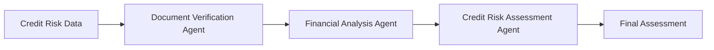

---
lab:
    title: 'Develop a multi-agent solution with Microsoft Agent Framework'
    description: 'Learn to configure multiple agents to collaborate using the Microsoft Agent Framework SDK'
    level: 300
    duration: 30
    islab: true
    status: 'released'
---

# Develop a multi-agent solution with Microsoft Agent Framework

**Note: We have already updated the mentioned files with the code mentioned in the instructions, but we would highly suggest going through it before executing it**

In this exercise, you'll practice using the sequential orchestration pattern in the Microsoft Agent Framework SDK. You'll create a simple pipeline of three agents that work together to process customer feedback and suggest next steps. You'll create the following agents:

- The Summarizer agent will condense raw feedback into a short, neutral sentence.
- The Classifier agent will categorize the feedback as Positive, Negative, or a Feature request.
- Finally, the Recommended Action agent will recommend an appropriate follow-up step.

You'll learn how to use the Microsoft Agent Framework SDK to break down a problem, route it through the right agents, and produce actionable results. Let's get started!

This exercise should take approximately **30** minutes to complete.

> **Note**: Some of the technologies used in this exercise are in preview or in active development. You may experience some unexpected behavior, warnings, or errors.

## Prerequisites

Before starting this exercise, ensure you have:

- [Visual Studio Code](https://code.visualstudio.com/) installed on your local machine
- An active [Azure subscription](https://azure.microsoft.com/free/)
- [Python 3.13](https://www.python.org/downloads/) or later installed
* **Foundry Toolkit for VS Code** extension

> **Tip:** If you haven't installed it yet, refer to the [Day 05 Lab 01: Agent Custom Tools](https://github.com/kiran-255666/AgenticAIEngineer/blob/main/Instructions/Exercises/Day05/lab01-agent-custom-tools.md) lab for installation instructions.


> \* Python 3.13 is available, but some dependencies are not yet compiled for that release. The lab has been successfully tested with Python 3.12.10.

## Use the deployed model

Use the deployed model that's already available in your Foundry project. Right-click the name of the project deployment and select **Copy Project Endpoint**. You'll need this URL to connect your agent to the Foundry project in the next steps.


# Get the application files from GitHub

1. If you have already downloaded and extracted the repository in a previous lab, delete the existing ZIP file and the extracted folder. This will allow us to use the PowerShell commands in the following steps and help avoid long path issues.

2. Open a web browser and go to the [lab files on GitHub](https://github.com/Kiran-255666/AgenticAIEngineer).

3. On the repository page, select the green **`<> Code`** button, and then select **Download ZIP**.

4. Once the download finishes, extract the ZIP file.

5. Open ****PowerShell**** and run the following two commands to avoid long path issues:

   

```powershell
Copy-Item "C:\Users\agenticuser\Downloads\AgenticAIEngineer-main\AgenticAIEngineer-main\labfiles\Day05\lab03-agent-framework-multi-agents" "$env:USERPROFILE\Desktop\lab03-agent-framework-multi-agents" -Recurse

code "$env:USERPROFILE\Desktop\lab03-agent-framework-multi-agents"
```

The first command copies the lab folder to your ****Desktop****, and the second command opens the copied folder directly in ****Visual Studio Code****.

This folder already contains the application files and the required code for this exercise.

6. You are now working from the ****Desktop**** folder, so there is no need to worry about the long path issue. Press ****Ctrl+Shift+`**** to open the integrated terminal.

7. In the terminal, enter the following commands to create and activate a virtual environment and install the required Python packages:

   ```
   python -m venv labenv
   .\labenv\Scripts\Activate.ps1
   pip install -r requirements.txt
   ```

8. The ****.env**** file is already configured for you. You do not need to change any of the existing values.

## Review the AI agents

The `agents.py` file already contains the code required to create and run the Credit Risk Assessment multi-agent workflow.

> **Note:** The code has already been updated for the current Credit Risk Assessment use case. Before running the application, review the code in `agents.py` and make sure the indentation and configuration are correct.

1. Open the **`agents.py`** file in the code editor.

2. At the top of the file, review the references under **Add references**:

```python
from agent_framework import Message
from agent_framework.foundry import FoundryChatClient
from agent_framework.orchestrations import SequentialBuilder
from azure.identity import AzureCliCredential
```

These libraries are used to create the Foundry chat client, define the agents, build the sequential orchestration, and process the agent messages.

3. In the `main()` function, review the instructions for the three agents:

   * **Document Verification Agent** → reviews the required company documents and checks whether the company names match.
   * **Financial Analysis Agent** → calculates the Current Ratio, Debt-to-Equity Ratio, and Net Profit Margin.
   * **Credit Risk Assessment Agent** → reviews the results from the previous agents and prepares a credit-risk assessment.

4. Review the **Create the chat client** section:

```python
credential = AzureCliCredential()

chat_client = FoundryChatClient(
    credential=credential,
    project_endpoint=os.getenv("AZURE_AI_PROJECT_ENDPOINT"),
    model=os.getenv("AZURE_AI_MODEL_DEPLOYMENT_NAME"),
)
```

The `AzureCliCredential` object authenticates the application using your Azure account. The `FoundryChatClient` connects to the Azure AI Foundry project using the project endpoint and model deployment configured in the `.env` file.

5. Review the **Create agents** section. The three agents are created from the same Foundry chat client, with each agent receiving its own instructions.

6. Review the **credit-risk data** provided to the workflow. The sample data contains information such as:

```text
Company: Apex Manufacturing Pvt Ltd
Financial Year: 2025
Current Assets: 7,800,000
Current Liabilities: 5,000,000
Total Debt: 9,300,000
Shareholders' Equity: 5,000,000
Revenue: 9,000,000
Net Profit: 500,000
External Credit Bureau Score: 720
Industry: Manufacturing
```

7. Review the **Build a sequential orchestration** section:

```python
workflow = SequentialBuilder(
    participants=[
        document_verification_agent,
        financial_analysis_agent,
        credit_risk_agent,
    ],
    output_from="all",
).build()
```

The agents process the credit-risk information in the order they are added to the orchestration. The `output_from="all"` setting collects the output from each agent so you can review the individual stages of the workflow.

The overall flow is:



8. Review the **Run and collect outputs** section:

```python
result = await workflow.run(
    f"Perform a credit-risk assessment using the following information:\n\n"
    f"{credit_risk_data}"
)

outputs = result.get_outputs()
```

This runs the sequential workflow and collects the outputs produced by the participating agents.

9. Review the **Display outputs** section:

```python
i = 1

for response in outputs:
    for msg in cast(list[Message], response.messages):
        name = msg.author_name or (
            "assistant" if msg.role == "assistant" else "user"
        )

        print(
            f"{'-' * 60}\n"
            f"{i:02d} [{name}]\n"
            f"{msg.text}"
        )

        i += 1
```

This formats and displays the messages returned by each agent so that you can see how the credit-risk assessment progresses through the workflow.

10. Press **Ctrl+S** to save the file.

## Test the application

The application is now ready to run.

1. In the integrated terminal, make sure you are logged in to Azure:

```powershell
az login
```

2. If your virtual environment is not already active, activate it:

```powershell
.\labenv\Scripts\Activate.ps1
```

3. Run the application:

```powershell
python agents.py
```

### Expected output

The exact wording can vary because the responses are generated by the AI agents. You should see output from the three agents in sequence.

The first agent should provide a document verification result similar to:

```text
------------------------------------------------------------
01 [document_verification]

Documents available and company names match.
```

The financial analysis agent should calculate values similar to:

```text
------------------------------------------------------------
02 [financial_analysis]

Current Ratio: 1.56
Debt-to-Equity Ratio: 1.86
Net Profit Margin: 5.56%
```

The credit-risk assessment agent should then summarize the information, for example:

```text
------------------------------------------------------------
03 [credit_risk_assessment]

Credit-risk assessment for Apex Manufacturing Pvt Ltd:

- Document verification: Documents available and company names match.
- Current Ratio: 1.56
- Debt-to-Equity Ratio: 1.86
- Net Profit Margin: 5.56%
- External Credit Bureau Score: 720
- Industry: Manufacturing

The assessment is based on the information provided in the workflow.
```

> **Note:** The exact responses may differ from these examples because the agents generate their responses dynamically. Focus on verifying that all three agents run successfully and that the output from each stage is passed through the sequential workflow.

4. You can modify the sample company or financial values in `credit_risk_data` and run the application again to observe how the agents respond to different inputs.

5. When you are finished, deactivate the virtual environment:

```powershell
deactivate
```

## Summary

In this exercise, you used **Agent Framework** to create a sequential multi-agent workflow for Credit Risk Assessment.

You reviewed how:

* The **Document Verification Agent** reviews required company documents.
* The **Financial Analysis Agent** calculates key financial ratios.
* The **Credit Risk Assessment Agent** uses the preceding outputs to prepare an assessment.
* **`SequentialBuilder`** passes the workflow through the agents in sequence.
* The outputs from all agents are collected and displayed for review.

The key takeaway is that a multi-agent workflow can divide a larger Credit Risk Assessment task into separate stages, with each specialized agent handling a specific part of the process.