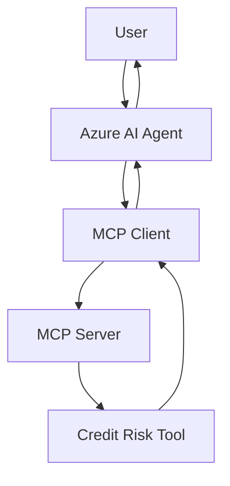
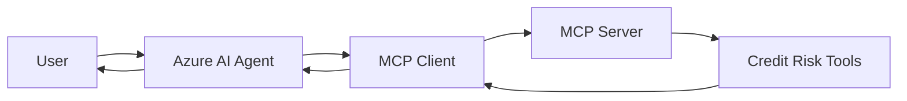

---
lab:
    title: 'Extend agents with Model Context Protocol (MCP) tools'
    description: 'Extend agent capabilities by integrating Model Context Protocol (MCP) server tools.'
    level: 300
    duration: 60
    islab: true
    status: 'released'
---

# Extend agents with Model Context Protocol (MCP) tools

**Note: We have already updated the mentioned files with the code mentioned in the instructions, but we would highly suggest going through it before executing it**

In this exercise, you'll use the Foundry Toolkit for VS Code extension to create an agent that can use Model Context Protocol (MCP) server tools to access external data sources and APIs. The agent will be able to retrieve up-to-date information and interact with custom services through MCP tools.

This exercise should take approximately **60** minutes to complete.

> **Note**: Some of the technologies used in this exercise are in preview or in active development. You may experience some unexpected behavior, warnings, or errors.

## Prerequisites

Before starting this exercise, ensure you have:

- [Visual Studio Code](https://code.visualstudio.com/) installed on your local machine
- An active [Azure subscription](https://azure.microsoft.com/free/)
- [Python 3.12 or above](https://www.python.org/downloads/) or later installed
- Install Azure CLI using the link- https://aka.ms/installazurecliwindows
- Foundry Toolkit for VS Code

> **Note:** If you have already installed and configured the **Foundry Toolkit for VS Code** extension, skip this section and proceed to the next step. If not, follow the installation steps in the [AgenticAIEngineer Day 05 Lab 01 documentation](https://github.com/uday-meteoros/AgenticAIEngineer/blob/main/Instructions/Exercises/Day05/lab01-agent-custom-tools.md).


> \* Python 3.13 is available, but some dependencies are not yet compiled for that release. The lab has been successfully tested with Python 3.12.

## Download the starter code repository

# Get the application files from GitHub

1. If you have already downloaded and extracted the repository in a previous lab, delete the existing ZIP file and the extracted folder. This will allow us to use the PowerShell commands in the following steps and help avoid long path issues.

2. Open a web browser and go to the [lab files on GitHub](https://github.com/Kiran-255666/AgenticAIEngineer).

3. On the repository page, select the green **`<> Code`** button, and then select **Download ZIP**.

4. Once the download finishes, extract the ZIP file.

5. Open ****PowerShell**** and run the following two commands to avoid long path issues:

```powershell
Copy-Item "C:\Users\agenticuser\Downloads\AgenticAIEngineer-main\AgenticAIEngineer-main\labfiles\Day05\lab04-mcp-integration" "$env:USERPROFILE\Desktop\lab04-mcp-integration" -Recurse

code "$env:USERPROFILE\Desktop\lab04-mcp-integration"
```

The first command copies the lab folder to your ****Desktop****, and the second command opens the copied folder directly in ****Visual Studio Code****.

This folder already contains the application files and the required code for this exercise.

> ****Note:**** The files have already been updated with the implementation required for this exercise. You do not need to enter the code manually again. However, we recommend reviewing the code to understand each section before running the application.

6. You are now working from the ****Desktop**** folder, so there is no need to worry about the long path issue. Press ****Ctrl+Shift+`**** to open the integrated terminal.

7. In the terminal, enter the following commands to create and activate a virtual environment and install the required Python packages:

   ```
   python -m venv labenv
   .\labenv\Scripts\Activate.ps1
   pip install -r requirements.txt
   ```

8. The ****.env**** file is already configured for you. You do not need to change any of the existing values.

> ****Tip:**** In general, if the ****.env**** file is not configured, you can use the previously installed ****Azure AI Foundry**** extension to get the required values. The **project endpoint** can be copied from the project deployment resource in the ****Foundry Toolkit**** extension in Visual Studio Code. You may need to do this in upcoming labs or when setting up your own projects in the future.

You are now ready to review creation an AI agent that uses MCP server tools to access external data sources and APIs.

# MCP Integration

In this exercise, you'll review and test a custom MCP server built for the Credit Risk Assessment workflow.

The required code is already available in the project. You will review how the MCP server exposes Credit Risk tools, how the MCP client connects to the server, and how the Azure AI Agent uses those tools.

## Review the Credit Risk MCP Server

Open `server.py`.

The file defines a custom MCP server named `CreditRisk` and exposes three tools:

- `verify_documents()` - checks the availability of the required company documents and verifies the company name.
- `calculate_financial_ratios()` - calculates the Current Ratio, Debt-to-Equity Ratio, and Net Profit Margin.
- `generate_risk_summary()` - generates a credit-risk summary using the provided financial ratios.

Review the `@mcp.tool()` decorator used above each function. This registers the Python function as an MCP tool.

Also review:

```python
mcp = FastMCP(name="CreditRisk")
````

This creates the MCP server.

At the bottom of the file:

```python
mcp.run(show_banner=False)
```

starts the MCP server and makes the registered tools available to the MCP client.

> **Note:** The code has already been updated for the Credit Risk Assessment use case. You do not need to recreate the previous Inventory example. Review the existing functions and understand what each one does.

## Review the MCP Client

Open `client.py`.

This file connects the Azure AI Agent to the local MCP server.

The overall flow is:



### Connect to the MCP Server

Review the `connect_to_server()` function.

The MCP server is started locally using:

```python
server_params = StdioServerParameters(
    command="python",
    args=["server.py"],
    env=None,
)
```

The client then establishes a stdio connection using `stdio_client()`.

### Initialize the MCP Session

Review:

```python
session = await exit_stack.enter_async_context(
    ClientSession(stdio, write)
)

await session.initialize()
```

This creates and initializes the MCP client session.

### Discover the MCP Tools

Review:

```python
response = await session.list_tools()
tools = response.tools
```

This retrieves the tools exposed by the MCP server.

The client should discover:

```text
verify_documents
calculate_financial_ratios
generate_risk_summary
```

### Connect the Tools to the Agent

The client creates wrapper functions for the discovered MCP tools using `make_tool_func()`.

These functions call the MCP server through:

```python
await session.call_tool(tool_name, kwargs)
```

The discovered tool schemas are then passed to the Azure AI Agent using `FunctionTool`.

This allows the agent to understand which tools are available and what parameters each tool requires.

### Process Tool Calls

When the agent decides that a tool is required, the response contains a function call.

The client identifies the requested tool:

```python
function_name = item.name
```

and reads the arguments:

```python
kwargs = json.loads(item.arguments)
```

The corresponding MCP tool is then called and its result is returned to the agent using `FunctionCallOutput`.

The agent can then use the tool result to generate the final response.

## Review the Azure AI Agent

The Azure AI Agent is created in `client.py` using `PromptAgentDefinition`.

Review the agent instructions.

The agent is configured to use the MCP tools for:

* Company document verification
* Financial ratio calculation
* Credit-risk summaries

The instructions also tell the agent not to invent missing financial, compliance, document, or credit information.

## Run the Credit Risk MCP Application

Before running the application, make sure you are signed in to Azure.

1. Check your Azure account:

```powershell
az account show
```

> If the command returns an error or does not show your Azure account details, run the following commands and then check again:
>
> ```powershell
> az logout
> az login # Use the provided credentials
> az account show
> ```

2. Ensure you have activated the virtual environment by **.\labenv\Scripts\Activate.ps1**

3. Run the MCP client:

```powershell
python client.py
```

The application will:

1. Start the local MCP server.
2. Connect the MCP client to the server.
3. Discover the available MCP tools.
4. Create the Azure AI Agent.
5. Wait for user input.

You should see output similar to:

```text
Connected to server with tools: ['verify_documents', 'calculate_financial_ratios', 'generate_risk_summary']
Agent created (id: ..., name: credit-risk-agent, version: ...)
```

## Test Document Verification

Enter:

```text
Verify whether the company registration certificate and GST certificate are available for Apex Manufacturing Pvt Ltd.
````

The agent should call:

```text
Calling tool: verify_documents
```

Review the response returned by the agent. It should indicate that the company name does not match across the provided documents.

For example:

```text
The documents could not be verified because there is a company name mismatch across the documents.
```

## Test Financial Ratio Calculation

Enter:

```text
Calculate the financial ratios for Apex Manufacturing Pvt Ltd using current assets of 500000, current liabilities of 250000, total debt of 300000, equity of 600000, net profit of 80000, and revenue of 1000000.
```

The agent should call:

```text
Calling tool: calculate_financial_ratios
```

Review the response returned by the agent. It should be similar to:

* Current Ratio: **2.00**
* Debt-to-Equity Ratio: **0.50**
* Net Profit Margin: **8.00%**

## Test the Credit Risk Summary

Enter:

```text
Generate a credit-risk summary for Apex Manufacturing Pvt Ltd using a current ratio of 2.0, debt-to-equity ratio of 0.5, and net profit margin of 8.0.
```

The agent should call:

```text
Calling tool: generate_risk_summary
```

Review the credit-risk summary returned by the agent. It should be similar to:

* Risk level: **Low**
* Liquidity: **Strong**, with a current ratio of 2.0
* Leverage: **Low**, with a debt-to-equity ratio of 0.5
* Profitability: **Healthy**, with a net profit margin of 8.0%

The response may also include an overall assessment similar to:

```text
Overall assessment: The company appears financially stable based on the provided ratios.
```

## Continue Testing

You can continue testing the agent with different Credit Risk Assessment prompts.

Try changing the financial values and observe how the tool output changes.

When you are finished, enter:

```text
quit
```

The application will exit and delete the agent version created during the current run.

> **Note:** The agent is created by the application each time you run `client.py`. The deletion step cleans up the agent created during that run. If you want to keep the agent after the application exits, remove or comment out the `delete_version()` code in `client.py`.

Finally, deactivate the virtual environment:

```powershell
deactivate
```

## Summary

In this exercise, you tested an Azure AI Agent that uses tools exposed through the Model Context Protocol (MCP).

You verified that:

* The **`verify_documents`** tool checks the availability of the required company documents and validates the company name across them.
* The **`calculate_financial_ratios`** tool calculates the Current Ratio, Debt-to-Equity Ratio, and Net Profit Margin from the provided financial data.
* The **`generate_risk_summary`** tool generates a credit-risk summary based on the provided financial ratios.

The overall flow is:



The main components are:

* **`server.py`** → defines and exposes the Credit Risk MCP tools.
* **`client.py`** → connects to the MCP server, discovers its tools, and makes them available to the Azure AI Agent.
* **Azure AI Agent** → decides when to use the available MCP tools and uses their results to respond to the user.

The key takeaway is that the agent does not directly implement the Credit Risk functions. The functions are exposed through MCP, discovered by the client, and made available to the agent as callable tools.
