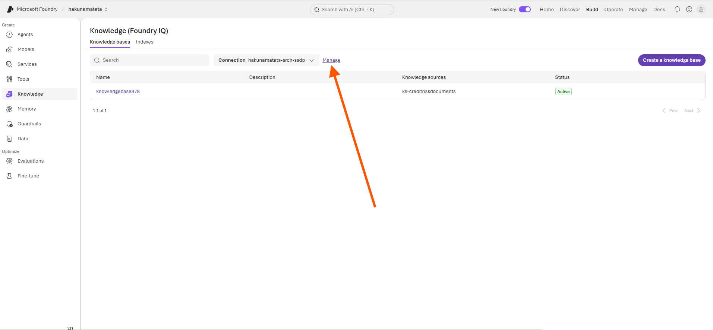
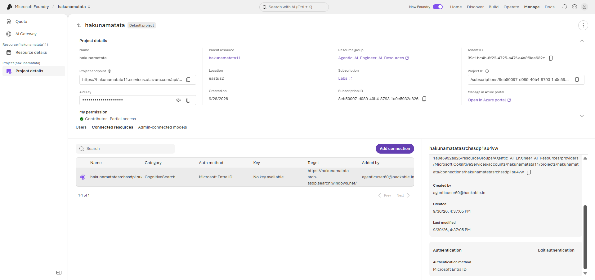

---
lab:
    title: 'Integrate an AI agent with Foundry IQ'
    description: 'Use Azure AI Agent Service to develop an agent that uses Foundry IQ to search knowledge bases.'
    level: 300
    duration: 45
    islab: true
    status: 'released'
---

# Integrate an AI agent with Foundry IQ

**Note: We have already updated the mentioned files with the code mentioned in the instructions, but we would highly suggest going through it before executing it**

In this exercise, you'll configure an AI agent that uses Foundry IQ to search and retrieve information from a knowledge base. You'll use your existing Foundry project and deployed models, create a search resource and knowledge base with credit-risk assessment data, configure an agent, and then connect to it from Visual Studio Code.

This exercise should take approximately **45** minutes to complete.

## Prerequisites

Before starting this exercise, ensure you have:

- An [Azure subscription](https://azure.microsoft.com/free/)
- [Visual Studio Code](https://code.visualstudio.com/) installed on your local machine
- [Python 3.13](https://www.python.org/downloads/) or later installed
- An existing Foundry project with deployed chat and embedding models
- Basic familiarity with the Microsoft Foundry portal and Python programming

## Use your Foundry project and deployed models

This lab uses the Foundry project and deployed models that are already available to you. You don't need to create a new Foundry project or deploy a new model for this exercise.

1. In a web browser, open the [Foundry portal](https://ai.azure.com) and sign in using your Azure credentials.
1. Select your existing Foundry project **(hakunamatata1)** from the project selector.
1. On the project home page, verify that **gpt-5.2** chat model and **text-embedding-3-small** embedding model are already deployed and available.
1. Keep the Foundry portal open. You'll use the existing chat model when creating the agent and knowledge base, and the existing embedding model when creating the knowledge source.

## Create an agent

Create an agent that will search the credit-risk knowledge base.

1. On the project home page, find the **Build an agent** card and select **Start building**.

2. Create an agent with a descriptive name, such as `credit-risk-assessment-agent-<unique_suffix>`, and set the **Interaction mode** to **Text**.

3. Select **Create**.

4. After the agent is created, the agent playground opens. You'll now configure the agent with credit-risk assessment information from Foundry IQ.


## Configure data and Foundry IQ

> ****Important:**** The following resource creation steps are ****optional****. We have already provisioned the required Azure AI Search and Storage Account resources for this lab, so you can skip these steps and use the provided resources. You can still go through these steps separately to explore and learn how these resources are created and configured.

First, add instructions to your agent. Then create a search resource, upload the credit-risk assessment documents, and create a knowledge base that connects those documents to the agent.

1. Give your agent the following instructions:

    ```
    You are a helpful AI assistant for credit-risk assessment.
    You must ALWAYS search the knowledge base to answer questions about the company documents,
    financial information, credit bureau information, and credit-risk assessment rules.
    Provide detailed, accurate information and always cite your sources.
    If you don't find relevant information in the knowledge base, say so clearly.
    ```

1. Select **Save** to save your current agent configuration.
1. In the **Knowledge** section, expand the **Add** dropdown and select **Connect to Foundry IQ**.
1. In the Foundry IQ setup window, select **Connect to an AI Search resource**, then select **Create new resource**.
1. Create a search resource with the following settings:

    - **Resource name**: A globally unique name
    - **Subscription**: Your Azure subscription
    - **Resource group**: Use the same resource group as your Foundry project  - **Agentic_AI_Engineer_AI_Resources**
    - **Region**: The same location as your Foundry project (If Quota is max change to Central US)
    - **Pricing tier**: Basic
    - Click tick check box I acknowledge that agentic retrieval usage beyond the free monthly allowance will incur additional costs , billed through Azure AI Search.
    - If asked about **Foundry IQ Knowledge base capabilities**: Pause until next month

The search resource provides the retrieval layer for the knowledge base. Next, upload the source credit-risk assessment documents.

1. Open the prepared credit-risk assessment PDF files from `labfiles\Day06\lab02-integrate-agent-with-foundry-iq\data`.

    The folder contains the following files:

    ```
    company_documents.pdf
    financial_data.pdf
    credit_bureau_report.pdf
    credit_risk_assessment_rules.pdf
    ```

1. Open the [Azure portal](https://portal.azure.com). In the top search bar, search for **Storage accounts** and select **Storage accounts**.
1. Click + Create for Creating a storage account with the following settings:

    - **Subscription**: Your Azure subscription - **Labs**
    - **Resource group**: Use the same resource group as your Foundry project - **Agentic_Al_Engineer_Al_Resources**
    - **Storage account name**: A unique storage account name
    - **Region**: The same location as your Foundry project - If at capacity Select Cental US
    - **Primary service**: Azure Blob Storage or Azure Data Lake Storage
    - **Performance**: Standard
    - **Redundancy**: Locally-redundant storage (LRS)

1. Click Review + Create then Create again.
1. After the storage account is created, **Click Go to Resource** to Open it.
1. Select **Upload** you can see at the top bar.
1. You see **Upload blob** pane, there click **create new**
1. Name it `creditriskdocuments`.
1. Anonymous access level be default **Private**
1. Click Ok.
1. Browse to the prepared credit-risk assessment files, select all four PDFs, and select **Upload**.
1. After the files are uploaded, navigate to the search service you created you can do it by clicking Resource Group name there you can see your search service
1. In the left pane, select **Security + networking** > **Keys**. For **API Access control**, select **Both** and confirm the selection.
1. Leave the Azure portal keep the tab open. Return to the Foundry portal and refresh the page.
1. On the **Knowledge (Foundry IQ)** page, select **Create a knowledge base**. 
1. You will be redirected to **Create a new knowledge base** there you can find **Knowledge sources (Foundry IQ)** Click it
1. Click **Add Source** Choose **Azure Blob Storage** as the knowledge source, then fill the following 
1. Configure the knowledge source with the following settings:

   * **Name**: `ks-creditriskdocuments`
   * **Description**: `Credit risk assessment documents`
   * **Storage account name**: Select your storage account
   * **Container name**: `creditriskdocuments`
   * **Authentication type**: API Key
   * **Content extraction mode**: minimal
   * **Embedding model**: Select your available deployed embedding model (text-embedding-3-small)
   * **Chat completions model**: Select your available deployed chat model (gpt-5.2)
   > **Note:** `gpt-5.4-mini` isn't available, so select `gpt-5.2` as the chat completions model.

1. Select **Create**.
1. It will take 1-2 Mintues Complete Saving Knowledge base
1. On the knowledge base creation page, for **Chat completions model** dropdown select **gpt-5.2** and leave the remaining settings unchanged.
1. Select **Save knowledge base**. Refresh the browser until the knowledge source status is **active**.
1. Select the back button to return to the **Knowledge** page, then select **Manage** next to the **Connection** dropdown.
    
1. Scroll to **Connected resources**, select your search service, and find the **Authentication** section.
1. Select **Key authentication**, then select **Edit authentication**.
    
1. You will be redirected to Edit authentication Change Auth Type to API via drop down and you will be needed to add API KEY 
1. Return reopen the azure portal there under keys > Manage admin keys > Primary admin key Copy key of it and paste it in **API Key**
1. Click Save

Your Foundry IQ knowledge base is now connected to the credit-risk assessment documents and ready for use by your agent.

## Configure the playground

1. Navigate back to your agent from the project home page. Select **View Deployments**, then select **Agents** from the side panel. Click the agent you created earlier, such as `credit-risk-assessment-agent-<unique_suffix>`.

2. Under **Tools**, select **Knowledge**, click **Add**, and then select **Connect to Foundry IQ**.

3. In the **Connect to Foundry IQ** pop-up, configure the following:

   * **Connection**: Selected displayed Connection
   * **Knowledge base**: Select Knowledge base

   Then select **Connect**.

4. Click Save

## Test the agent in the playground

Use the following expected responses to verify that the agent is successfully retrieving information from the Foundry IQ knowledge source.

#### Query 1

**Prompt**

```text
Retrieve information from the connected knowledge source and tell me what documents are available for Apex Manufacturing Pvt Ltd. List each available document and include the company name and registration status mentioned in the documents.
```

**Expected AI Response**

- Company Registration Certificate
  - Company Name: Apex Manufacturing Pvt Ltd
  - Registration Status: Active

- GST Registration Certificate
  - Company Name: Apex Manufacturing Pvt Ltd
  - Registration Status: Active

- Both required documents are available.
- Company names match across the provided documents.

---

#### Query 2

**Prompt**

```text
Retrieve the financial information for Apex Manufacturing Pvt Ltd for the financial year 2025 from the connected knowledge source. Include current assets, current liabilities, total debt, shareholders' equity, revenue, and net profit.
```

**Expected AI Response**

- Company Name: Apex Manufacturing Pvt Ltd
- Financial Year: 2025
- Current Assets: 7,800,000
- Current Liabilities: 5,000,000
- Total Debt: 9,300,000
- Shareholders' Equity: 5,000,000
- Revenue: 9,000,000
- Net Profit: 500,000

The agent should successfully retrieve the required financial information from the connected Foundry IQ knowledge source.

---

#### Query 3

**Prompt**

```text
Retrieve the external credit bureau information for Apex Manufacturing Pvt Ltd from the connected knowledge source. Tell me the external credit bureau score, industry, and credit bureau status, and mention whether any adverse records are reported.
```

**Expected AI Response**

- External Credit Bureau Score: 720
- Industry: Manufacturing
- Credit Bureau Status: No adverse records reported
- Adverse Records Reported: No

The agent should successfully retrieve the credit bureau information from the connected Foundry IQ knowledge source and return the credit score, industry classification, credit bureau status, and adverse record details.

1. In the agent details page, copy the following information to a notepad. You'll use these values when configuring the client application:

    - **Agent name**: The name you created, such as `credit-risk-assessment-agent-<unique_suffix>`
    - **Project endpoint**: Available from the project home page such as `https://hakunamatata11.services.ai.azure.com/api/projects/hakunamatata`

# Connect to your agent from an app

Now that the agent and knowledge base work in the portal, use the provided Python application to communicate with the agent programmatically.

# Get the application files from GitHub

1. If you have already downloaded and extracted the repository in a previous lab, delete the existing ZIP file and the extracted folder. This will allow us to use the PowerShell commands in the following steps and help avoid long path issues.

2. Open a web browser and go to the [lab files on GitHub](https://github.com/Kiran-255666/AgenticAIEngineer).

3. On the repository page, select the green **`<> Code`** button, and then select **Download ZIP**.

4. Once the download finishes, extract the ZIP file.

5. Open ****PowerShell**** and run the following two commands to avoid long path issues:

```powershell
Copy-Item "C:\Users\agenticuser\Downloads\AgenticAIEngineer-main\AgenticAIEngineer-main\labfiles\Day06\lab02-integrate-agent-with-foundry-iq" "$env:USERPROFILE\Desktop\lab02-integrate-agent-with-foundry-iq" -Recurse

code "$env:USERPROFILE\Desktop\lab02-integrate-agent-with-foundry-iq"
```

The first command copies the lab folder to your ****Desktop****, and the second command opens the copied folder directly in ****Visual Studio Code****.

This folder already contains the application files and the required code for this exercise.

6. You are now working from the ****Desktop**** folder, so there is no need to worry about the long path issue. Press ****Ctrl+Shift+`**** to open the integrated terminal.

7. In the terminal, enter the following commands to create and activate a virtual environment and install the required Python packages:

   ```
   python -m venv labenv
   .\labenv\Scripts\Activate.ps1
   pip install -r requirements.txt
   ```

8. Configure the environment variables
Open the **`.env`** file from the side panel and fill in the following:

    ```
    PROJECT_ENDPOINT=https://hakunamatata11.services.ai.azure.com/api/projects/hakunamatata
    AGENT_NAME=credit-risk-assessment-agent-<your_suffix>
    ```
    
Replace `<your_suffix>` with the unique suffix you used when creating the agent.

## Review the agent client code

The required client code has already been added to **`agent_client.py`**. Review the file before running the application.

The client connects to the existing Microsoft Foundry agent, creates a conversation, sends user questions to the agent, and displays the responses returned from the connected Foundry IQ knowledge source.

### Load the configuration

The application loads the project endpoint and agent name from the `.env` file:

```python
load_dotenv()

project_endpoint = os.getenv("PROJECT_ENDPOINT")
agent_name = os.getenv("AGENT_NAME")
```

The client checks that both values are available before connecting to the Foundry project.

### Connect to the Foundry project

The client uses `DefaultAzureCredential` to authenticate and `AIProjectClient` to connect to the existing Foundry project:

```python
credential = DefaultAzureCredential(
    exclude_environment_credential=True,
    exclude_managed_identity_credential=True
)

project_client = AIProjectClient(
    credential=credential,
    endpoint=project_endpoint
)
```

### Connect to the agent

The client retrieves the existing agent using the agent name configured in `.env`:

```python
agent = project_client.agents.get(
    agent_name=agent_name
)

print(f"Connected to: {agent.name}")
```

This allows the Python application to send questions to the agent that was configured with Foundry IQ.

### Create a conversation

The client creates a conversation for the current session:

```python
conversation = openai_client.conversations.create()
```

The same conversation is used for the questions entered during the session.

### `send_message_to_agent`

The `send_message_to_agent()` function sends the user's question to the connected Foundry agent:

```python
def send_message_to_agent(user_message):
    response = openai_client.responses.create(
        conversation=conversation.id,
        extra_body={
            "agent_reference": {
                "name": agent.name,
                "type": "agent_reference"
            }
        },
        input=user_message
    )

    print("\nAgent:")
    print(response.output_text)
```

The user's question is sent to the agent using the Responses API. The agent can use the connected Foundry IQ knowledge source to retrieve relevant information before generating its response.

The returned response is then displayed in the terminal.

### `main`

The `main()` function provides the command-line interface:

```python
def main():
    while True:
        try:
            user_input = input("\nYou: ").strip()

            if not user_input:
                continue

            if user_input.lower() in {"quit", "exit"}:
                print("\nConversation ended.")
                break

            send_message_to_agent(user_input)

        except KeyboardInterrupt:
            print("\n\nConversation ended.")
            break

        except Exception as e:
            print(f"\nError: {str(e)}")
```

You can continue asking questions during the same conversation.

To stop the application, enter **`quit`**, enter **`exit`**, or press **Ctrl+C**.

## Test the integration

1. In the integrated terminal, verify that you are signed in to Azure:

```powershell
az account show
```

> **Note:** If you encounter an authentication issue, run `az logout`, then `az login`, and run `az account show` again.

2. Run the client:

```powershell
python agent_client.py
```

3. You should see output similar to:

```text
Credit Risk Assessment Agent
----------------------------
Connected to: credit-risk-assessment-agent-uday
Ask questions about the credit-risk assessment.
Type 'quit' or 'exit' to stop.
```

4. Test the following queries.

### Test Case 1: Company documents

Enter:

```text
What documents are available for Apex Manufacturing Pvt Ltd?
```

The agent should retrieve information similar to:

```text
For Apex Manufacturing Pvt Ltd, the available documents are:

1. Company Registration Certificate
   Registration Number: U29299KA2018PTC112345
   Status: Active

2. GST Registration Certificate
   GSTIN: 29AABCA1234F1Z5
   Status: Active

3. Financial Information for Financial Year 2025

4. Credit Bureau Report
   External Credit Bureau Score: 720
   No adverse records reported

5. Credit Risk Assessment Rules
```

The response should include source citations when they are available.

### Test Case 2: Financial information

Enter:

```text
What financial information is available for Apex Manufacturing Pvt Ltd for 2025?
```

The agent should retrieve:

```text
Company Name: Apex Manufacturing Pvt Ltd
Financial Year: 2025

Current Assets: 7,800,000
Current Liabilities: 5,000,000
Total Debt: 9,300,000
Shareholders' Equity: 5,000,000
Revenue: 9,000,000
Net Profit: 500,000
```

### Test Case 3: Financial ratios

Enter:

```text
What are the current ratio, debt-to-equity ratio, and net profit margin for Apex Manufacturing Pvt Ltd?
```

The agent should calculate:

```text
Current Ratio:
7,800,000 / 5,000,000 = 1.56

Debt-to-Equity Ratio:
9,300,000 / 5,000,000 = 1.86

Net Profit Margin:
(500,000 / 9,000,000) × 100 = 5.56%
```

The response should reference the financial information and assessment rules used for the calculations.

### Test Case 4: Credit bureau information

Enter:

```text
What is the external credit bureau score and industry for Apex Manufacturing Pvt Ltd?
```

The agent should retrieve:

```text
External Credit Bureau Score: 720
Industry: Manufacturing
Credit Bureau Status: No adverse records reported
```

### Test Case 5: Credit-risk assessment rules

Enter:

```text
What credit-risk assessment rules should be used for Apex Manufacturing Pvt Ltd?
```

The agent should retrieve information about:

```text
Document Verification
Compliance
Financial Analysis
External Credit Bureau
Industry Risk
Scorecard
Final Risk Classification
Credit Recommendation
```

For Apex Manufacturing Pvt Ltd, the agent should identify **Manufacturing** as a **Medium Risk** industry according to the connected assessment rules.

### Review the results

When testing the agent, verify that:

* The agent retrieves information from the connected Foundry IQ knowledge source.
* Company, financial, and credit bureau information matches the provided documents.
* Financial ratios are calculated using the assessment rules.
* The agent can retrieve the credit-risk assessment rules.
* Source citations are displayed when available.
* Multiple questions can be asked within the same conversation.
* The agent does not invent information that is not available in the connected knowledge source.

> **Note:** The exact wording and formatting may differ because the response is generated by the AI agent. Focus on whether the retrieved information is accurate and grounded in the connected knowledge source.

## End the session

When you are finished testing, enter:

```text
quit
```

or:

```text
exit
```

You can also press **Ctrl+C** to stop the application.

To start a new session later, run:

```powershell
python agent_client.py
```

## Summary

In this exercise, you connected a Python client to an existing Microsoft Foundry agent configured with Foundry IQ.

You reviewed the client code, created a conversation, sent questions about Apex Manufacturing Pvt Ltd, and verified that the agent could retrieve company documents, financial information, credit bureau information, and assessment rules from the connected knowledge source.

The key takeaway is that the Python client provides a simple interface for interacting with a **Foundry IQ-enabled agent** and retrieving grounded information from the connected knowledge source.
