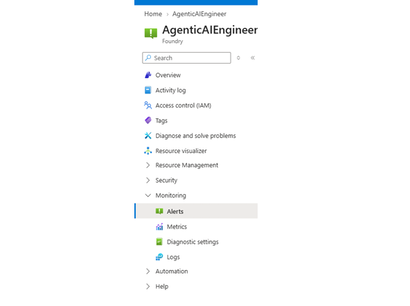
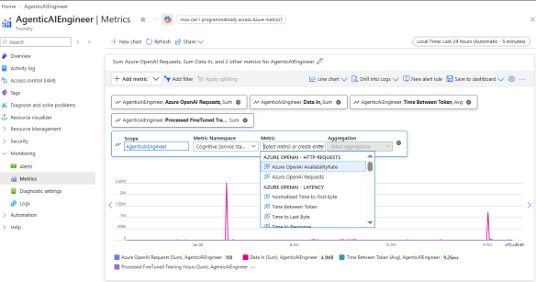
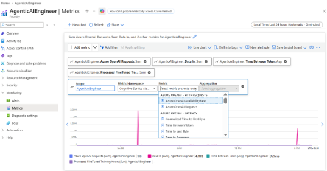

# Lab: Monitor Your Azure AI Foundry Project

*Using Azure Monitor metrics, alerts, diagnostic settings, and logs*

<table align="center">
<tr>
<th>Project</th>
<td>AgenticAIEngineer</td>
</tr>
<tr>
<th>Platform</th>
<td>Microsoft Azure Portal / Microsoft Foundry</td>
</tr>
<tr>
<th>Lab Type</th>
<td>Monitoring and observability</td>
</tr>
</table>

## 1. Lab Overview

In this lab, learners will monitor the Microsoft Foundry project named **AgenticAIEngineer** from the Azure portal. They will explore the Monitoring section, understand the purpose of each monitoring option, and create a Metrics view with multiple Azure OpenAI metrics.

## 2. Main Objective

The main objective of this lab is to help learners understand how to monitor an Azure AI Foundry project so that usage, performance, availability, and troubleshooting signals can be reviewed from one place.

## 3. Learning Outcomes

- Sign in to the Azure portal and open the **AgenticAIEngineer** Foundry project.
- Identify the Monitoring options available in the resource menu.
- Understand the purpose of Alerts, Metrics, Diagnostic settings, and Logs.
- Build a metric chart by adding at least five Azure OpenAI metrics.
- Use the chart to review operational signals such as request count, data usage, latency, and availability.

## 4. Prerequisites

- Azure portal access with the provided credentials.
- Access to the **AgenticAIEngineer** Microsoft Foundry project.
- Sufficient permission to view Monitoring and Metrics for the resource.
- Recent activity on the project is helpful so that metrics display meaningful values.

## 5. Step-by-Step Instructions

### Step 1: Sign in to the Azure Portal

1. Open Microsoft Edge or any supported browser.
2. Go to the Azure portal.
3. Sign in using the credentials provided for the lab.
4. Wait until the Azure portal home page loads.

### Step 2: Open the Foundry Project

1. In the Azure portal search bar, type **Foundry**.
2. From the search results, open the Foundry resource or service.
3. Select the project named **AgenticAIEngineer**.
4. Confirm that the **AgenticAIEngineer** project overview page is displayed.

### Step 3: Expand the Monitoring Section

1. From the left menu, scroll down until the **Monitoring** section is visible.
2. Expand Monitoring to view the available monitoring options.
3. Review the available options before opening Metrics.

*Figure 1: Monitoring menu showing Alerts, Metrics, Diagnostic settings, and Logs.*

### Step 4: Understand the Monitoring Options

The Monitoring section contains several options. Explain the purpose of each option to learners before they start configuring metrics.

<table align="center">
<tr>
<th>Monitoring Option</th>
<th>Purpose</th>
<th>How It Helps in This Lab</th>
</tr>
<tr>
<td><b>Alerts</b></td>
<td>Used to notify administrators when a configured metric or log condition is met.</td>
<td>Helps make monitoring proactive instead of manually checking charts.</td>
</tr>
<tr>
<td><b>Metrics</b></td>
<td>Used to view numeric time-series data for the resource, such as request count, latency, and availability.</td>
<td>This is the main area used in the lab to build a monitoring chart.</td>
</tr>
<tr>
<td><b>Diagnostic settings</b></td>
<td>Used to route platform logs and metrics to destinations such as Log Analytics, Storage Account, or Event Hub.</td>
<td>Learners understand how monitoring data can be retained or sent for advanced analysis.</td>
</tr>
<tr>
<td><b>Logs</b></td>
<td>Used to query detailed log data, usually with KQL, when diagnostic data is available.</td>
<td>Learners understand where to investigate detailed events and support troubleshooting.</td>
</tr>
</table>

### Step 5: Open Metrics

1. Under Monitoring, select **Metrics**.
2. Confirm that the scope is set to **AgenticAIEngineer**.
3. Set the time range to an appropriate value, such as **Local Time: Last 24 hours**.
4. Use **Add metric** to start adding metrics to the chart.

*Figure 2: Metrics Explorer area where multiple metrics are added to the chart.*

### Step 6: Add Metrics to the Chart

> **Important:** Add at least five metrics. Repeat the Add metric process for each metric listed below.

#### Metric 1: Azure OpenAI Requests

1. Click **Add metric**.
2. Keep the Scope as **AgenticAIEngineer**.
3. Select the appropriate Metric Namespace, such as **Cognitive Services / Azure OpenAI metrics**.
4. In the Metric dropdown, select **Azure OpenAI Requests**.
5. In Aggregation, select **Sum**.
6. Confirm that the metric appears as a chip above the chart.
7. Repeat the same Add metric process for the next metric.

> **Why this metric is useful:** Shows the total number of Azure OpenAI requests during the selected time range.

#### Metric 2: Data In

1. Click **Add metric**.
2. Keep the Scope as **AgenticAIEngineer**.
3. Select the appropriate Metric Namespace, such as **Cognitive Services / Azure OpenAI metrics**.
4. In the Metric dropdown, select **Data In**.
5. In Aggregation, select **Sum**.
6. Confirm that the metric appears as a chip above the chart.
7. Repeat the same Add metric process for the next metric.

> **Why this metric is useful:** Shows how much input data is sent to the service.

#### Metric 3: Time Between Token

1. Click **Add metric**.
2. Keep the Scope as **AgenticAIEngineer**.
3. Select the appropriate Metric Namespace, such as **Cognitive Services / Azure OpenAI metrics**.
4. In the Metric dropdown, select **Time Between Token**.
5. In Aggregation, select **Average**.
6. Confirm that the metric appears as a chip above the chart.
7. Repeat the same Add metric process for the next metric.

> **Why this metric is useful:** Shows the average delay between streamed tokens and helps review response streaming performance.

#### Metric 4: Time to First Byte

1. Click **Add metric**.
2. Keep the Scope as **AgenticAIEngineer**.
3. Select the appropriate Metric Namespace, such as **Cognitive Services / Azure OpenAI metrics**.
4. In the Metric dropdown, select **Time to First Byte**.
5. In Aggregation, select **Average**.
6. Confirm that the metric appears as a chip above the chart.
7. Repeat the same Add metric process for the next metric.

> **Why this metric is useful:** Shows how quickly the service starts returning the response after a request is submitted.

#### Metric 5: Azure OpenAI Availability Rate

1. Click **Add metric**.
2. Keep the Scope as **AgenticAIEngineer**.
3. Select the appropriate Metric Namespace, such as **Cognitive Services / Azure OpenAI metrics**.
4. In the Metric dropdown, select **Azure OpenAI Availability Rate**.
5. In Aggregation, select **Average**.
6. Confirm that the metric appears as a chip above the chart.
7. Repeat the same Add metric process for the next metric.

> **Why this metric is useful:** Shows service availability for the selected time range.

### Optional Metrics to Explore

- Time to Last Byte
- Time to Response
- Processed Fine-Tuned Training Hours
- Generated Completion Tokens
- Generated Prompt Tokens
- Total Tokens

### Step 7: Review the Metrics Chart

1. Review the chart after all selected metrics are added.
2. Check whether the lines or values show request activity, data usage, latency, or availability patterns.
3. Use the legend under the chart to identify each metric.
4. Use the time range selector if you want to review another time window.
5. Optionally, use **Save to dashboard** if the chart should be reused later.

## 6. Lab Conclusion

In this lab, we monitored the **AgenticAIEngineer** Microsoft Foundry project from the Azure portal. We explored the Monitoring section and understood how Alerts, Metrics, Diagnostic settings, and Logs support operational visibility.

> **Key takeaway:** Monitoring is important because it gives visibility into how an AI resource is performing and being used. Metrics provide a quick operational view, while logs and diagnostic settings support deeper troubleshooting and long-term analysis.