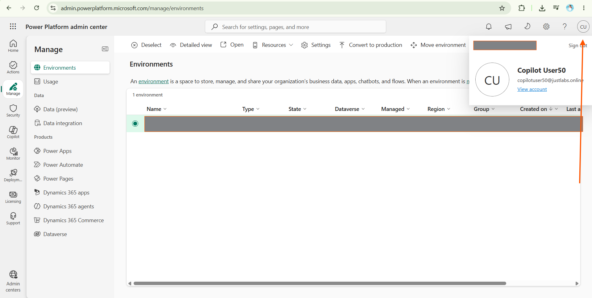

---
lab:
  title: ILT Setup
  module: Introduction
  description: In this exercise, you will access the Microsoft Copilot Studio portal and create an environment and solution to use throughout the remaining labs.
  duration: 10 minutes
  level: 200
  islab: true
  primarytopics:
    - Microsoft Copilot
    - Microsoft Copilot Studio
---

## Exercise 1 Create a Power Platform environment

### Task 1.1 - Power Platform Admin Center

Before you start the lab exercises, you must create a development environment for you to work in.

1. Open a web browser and navigate to the **Power Platform admin center** https://admin.powerplatform.microsoft.com/manage/environments. If you are already signed in with your **@hackable.in** account, ensure you sign out first, then sign in with the new **@justlabs.online** account provided for this lab.
   
   
   
1. If prompted, choose the option to stay signed in.
1. Close any pop-up messages that are displayed.

### Task 1.2 - Create a new environment

1. In the sidebar, select **Manage**.
1. In the **Environments** page, select **+ New**.
   
1. In the **New environment** panel, set **Type** to Trial and **Region** to the default region shown (a local region provides quicker data access).
   
1. Enter your name in the **Name** field.
   
1. Expand **Change default settings**. Under **Add a Dataverse data store?**, select **Yes**.
   
   > [!NOTE]
   > Pay-as-you-go with Azure is unavailable for Trial environments — only Production and Sandbox environments support this setting.

1. Select **Next**. In the **Add Dataverse** panel, set the following:
   - **Language**: leave as it is if already English (United States), otherwise select English (United States) and move to the next field
   - **Currency**: leave as default
   - **Security group**: Click **+ Select** and in **Edit security group** find **open access** click **None** and Click **Done**
   
   - **URL**: leave as default
   - **Enable Dynamics 365 apps?**: leave as it is (locked to No), move to the next field
   - **Deploy sample apps and data?**: No

   > [!NOTE]
   > Currency defaults based on your region (for example, INR for India). Enable Dynamics 365 apps is disabled for Trial environments — it's only available for Production or Sandbox environments.
   
   

1. Select **Save** and wait until the environment state is **Ready** (use **Refresh** to update the display).

   > [!NOTE]
   > Environment provisioning can take several minutes depending on tenant configuration.

   

### Task 1.3 - Access Copilot Studio

1. In a new browser tab, open **Copilot Studio** https://copilotstudio.microsoft.com/ and sign in if prompted.

   

   

   
Does your interface look different? Click here

   
   

   Select **...** (More options) at the bottom of the page. Under **Explore**, select **Open Classic Experience**. These labs use the **Classic Experience**.
   
   

2. Look at the **upper-right corner** of the page. Just to the left of the **Settings** ⚙️ icon, you will see the **Environment Selector** showing your current environment.

   

3. Check the **Environment Selector**. If your *named environment* is already displayed, use it.

   

   
Can't see your named environment? Click here

   a. Select the **Environment Selector**.

   

   b. The **Switch environment** menu will open.

   

   c. Under **Supported environments**, select your **named environment**.

   

   d. Your **named environment** should now be shown in the **Environment Selector**.

   

   

### Task 1.4 - Create a solution

1. In the left navigation pane, select the ellipses (**...**), then select **Solutions**.
1. Confirm you see the *Default Solution* and *Common Data Services Default Solution* listed.

   

1. Select **+ New solution**.
1. Enter `Lab Exercises` in the **Display name** field. The **Name** field should automatically populate with Lab Exercises, matching the Display name exactly.
1. Select **+ New publisher** below the **Publisher** drop-down.
1. Enter `Fabrikam_unique_Suffix` for Display name, `fabrikam_unique_suffix` for Name, Leave the Description field empty and proceed to the next field, Prefix. Now fill `fab` for Prefix, then select **Save**.
1. Confirm **Fabrikam (fabrikam)** is selected in the **Publisher** drop-down.
1. Select the **Set as your preferred solution** checkbox.

   > [!NOTE]
   > Setting this as your preferred solution ensures new assets created during later labs are added to the Lab Exercises solution by default.

   

1. Select **Create**.
1. Close the **Solutions** browser tab, then refresh the **Copilot Studio** page.

You now have a Power Platform environment and solution to work in.
