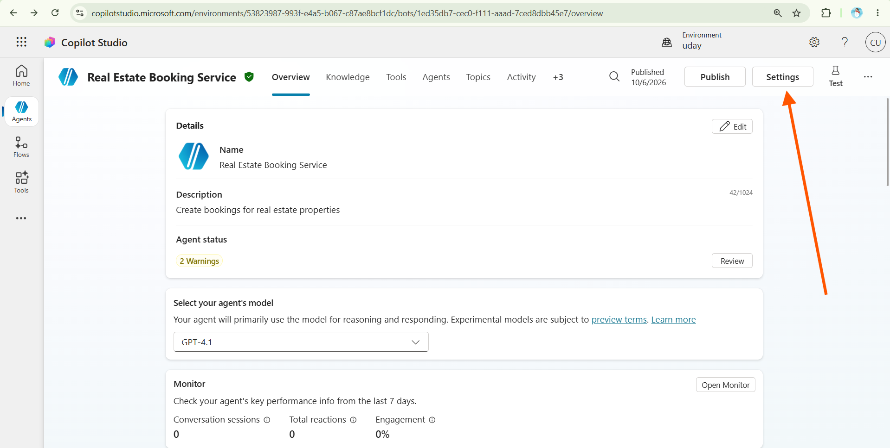
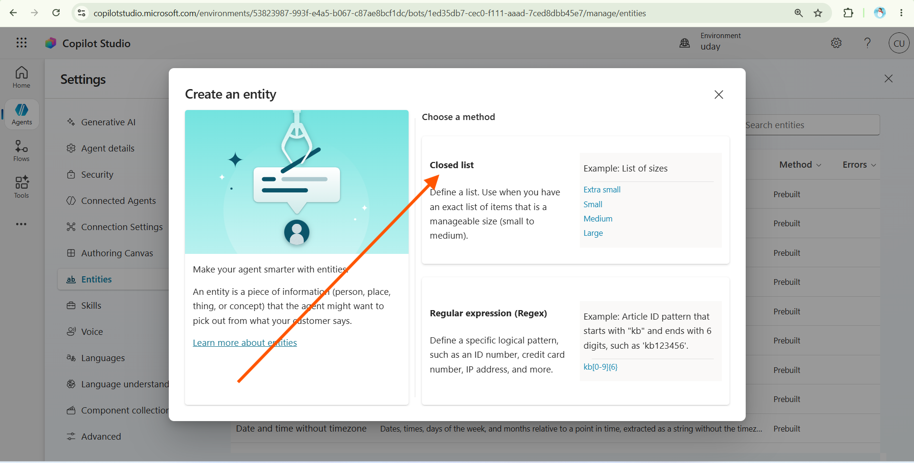
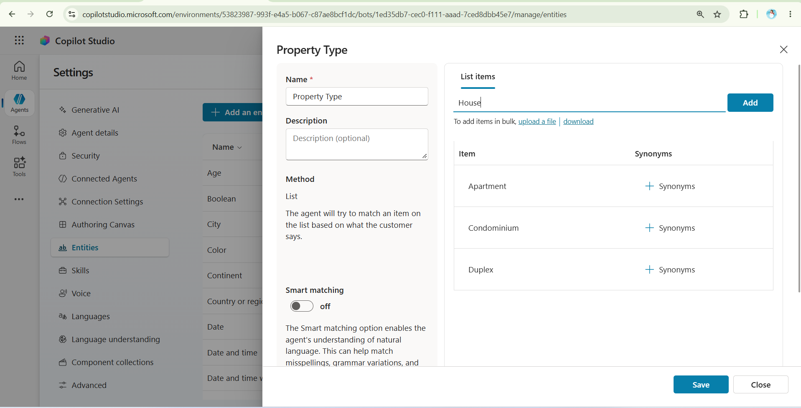
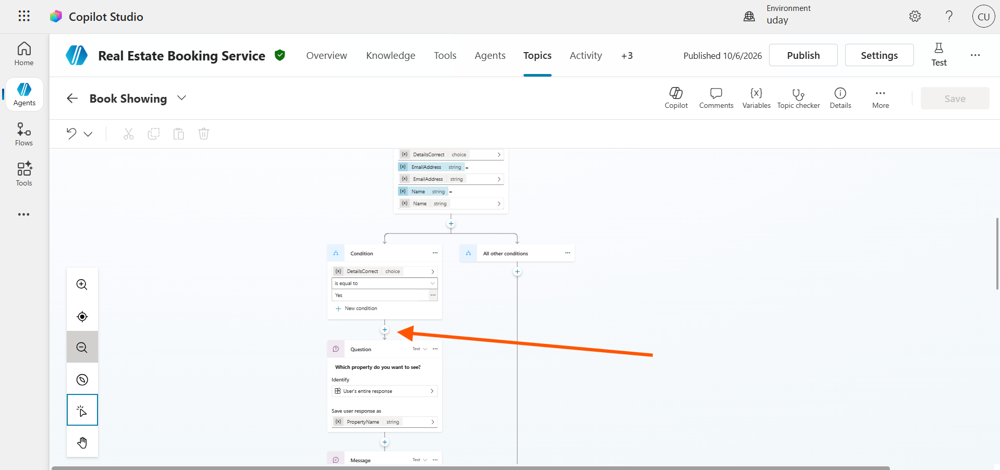
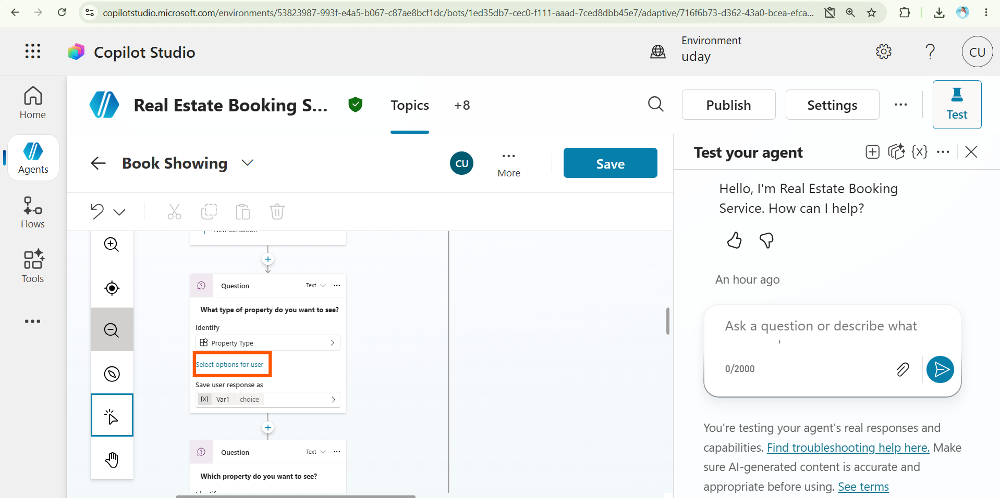
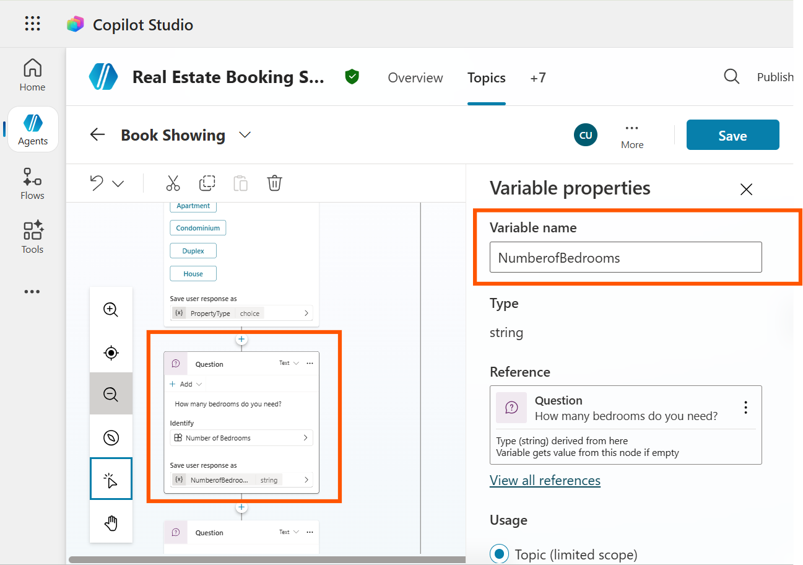

---
lab:
  title: Work with entities
  description: Learn how to create and use prebuilt and custom entities in Microsoft Copilot Studio to help the agent understand specific information provided by users.
  level: 300
  duration: 20
  islab: true
  status: 'released'
---

# Work with entities

Microsoft Copilot Studio uses entities to identify and understand specific types of information provided by users, such as property types and numbers. You can use prebuilt entities or create custom entities to meet the needs of your agent.

In this lab, you'll explore prebuilt entities, create custom entities for property types and bedroom counts, and use them in the booking conversation.

This exercise will take approximately **20** minutes.

### Exercise 1 - Create entities

Microsoft Copilot Studio uses entities to understand user intent. There are many prebuilt entities included for commonly used information. You can create custom entities for your specific purpose.

#### Task 1.1 - View prebuilt entities

1. Navigate to the Microsoft Copilot Studio portal https://copilotstudio.microsoft.com and ensure you are in the appropriate environment that you created just now.

2. Ensure you are using Classic Experince. Then select Agents from the left navigation pane.

3. Select the Real Estate Booking Service agent you created in the earlier lab.

4. Select Settings in the upper-right of the screen.

   

5. Select the Entities tab. You should see a list of the prebuilt entities for your agent.

#### Task 1.2 - Create the property type entity

1. Select **+ Add an entity** and select **+ New entity**.

2. Select the Closed list tile.

    

3. Enter **`Property Type`** in the **Name field**.

4. In the **Enter item** field, enter the following values, selecting **Add** after each one:

   * **`Apartment`**
   * **`Condominium`**
   * **`Duplex`**
   * **`House`**

   

5. Select **+ Synonyms for Apartment**, enter **`Flat`** and select the **+ icon** and select **Done**.

6. Select **+ Synonyms for Condominium**, enter **`Townhouse`** and select the **+ icon** and select **Done**.

7. Select **+ Synonyms for House**, enter **`Single-family`** home and select the **+ icon** and select **Done**.

8. Select **+ Synonyms for Duplex**, enter **`Duplex home`**, select the **+ icon**, and select **Done**.

9. Enable **Smart matching** by selecting the toggle to change it from **Off** to **On**.

10. Select Save.

11. Once the entity is saved, close the Property Type window.

#### Task 1.3 - Create number of bedrooms entity

1. Select **+ Add an entity** and select **+ New entity**.

2. Select the **Regular expression (Regex) tile**.

3. Enter **`Number of Bedrooms`** in the **Name field**.

4. Enter **`[1-5]`** in the Pattern field.

5. Select Save.

6. Once the entity is saved, close the Number of Bedrooms pane.

7. Select the **X** icon in the top-right to close out of Settings and return to your agent.

### Exercise 2 - Use entities to improve the agent

Use entities in the conversational flow to improve the agent.

#### Task 2.1 - Use entities

1. Select the **Topics** tab.

2. Select the **Book Showing** topic.

3. Select the + icon between the Condition and property Question nodes, then select Ask a question.

   

4. In the Enter a message field, enter the following text: **`What type of property do you want to see?`**

5. Select Property Type for Identify.

   

6. Select Select options for user and check the Display option for all four values.

   

7. Select the variable (generally **`Var1`**) in **Save user response as**. A pop-up appears on the right side. Enter **`PropertyType`** in the **Variable name** field.

8. Select the + icon below the new Question node and select Ask a question.

9. In the Enter a message field, enter the following text: **`How many bedrooms do you need?`**

10. Select Number of Bedrooms for Identify.

11. Click on **Var2** under the Save user response as and enter NumberofBedrooms for Variable name

   

12. Select Save.

Congratulations, you have completed Lab2. Please close the current document and move to the next one.

## Conclusion

In this lab, you explored prebuilt entities and created custom entities for property types and the number of bedrooms. You also used these entities in the booking conversation to help the agent collect and understand specific information from users.

You have now learned how to create and use entities to improve the conversational flow of an agent in Copilot Studio.